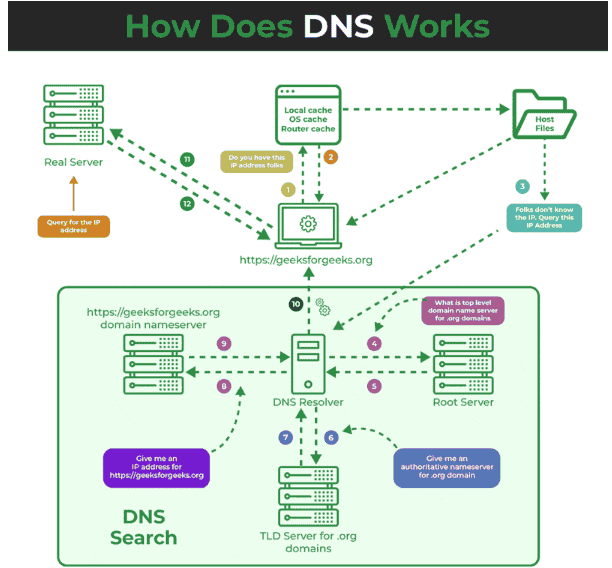
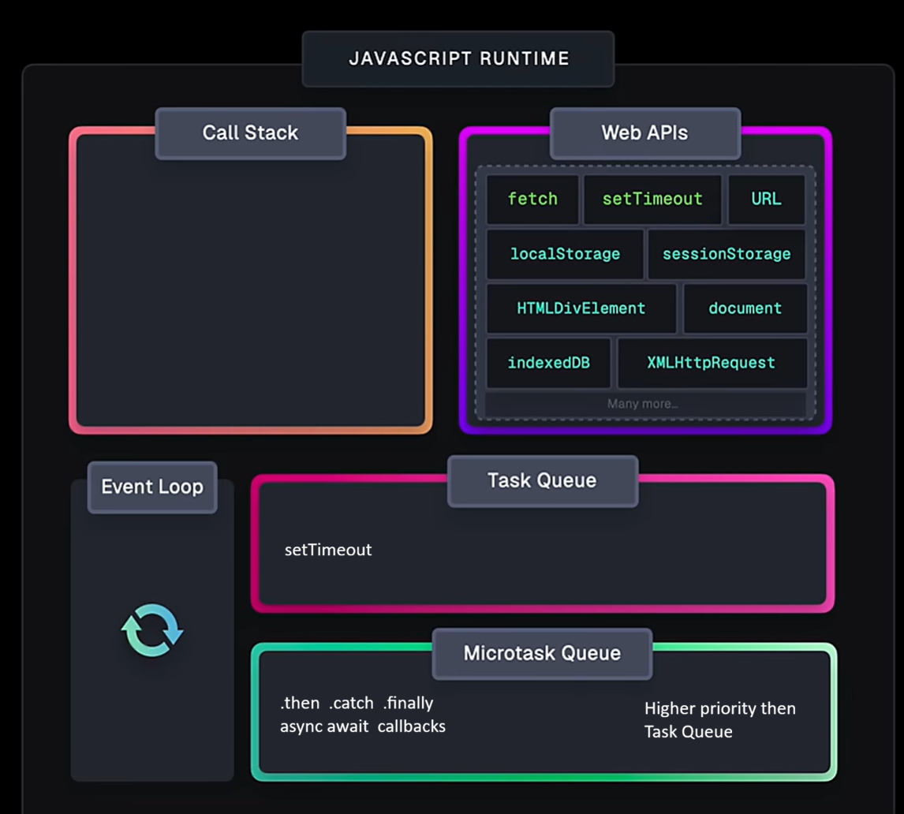
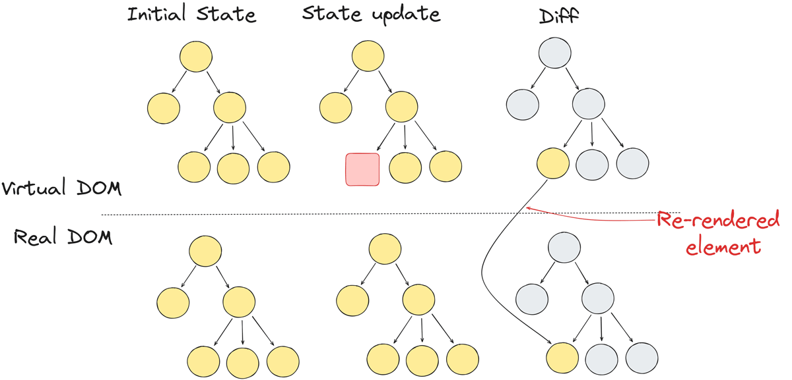
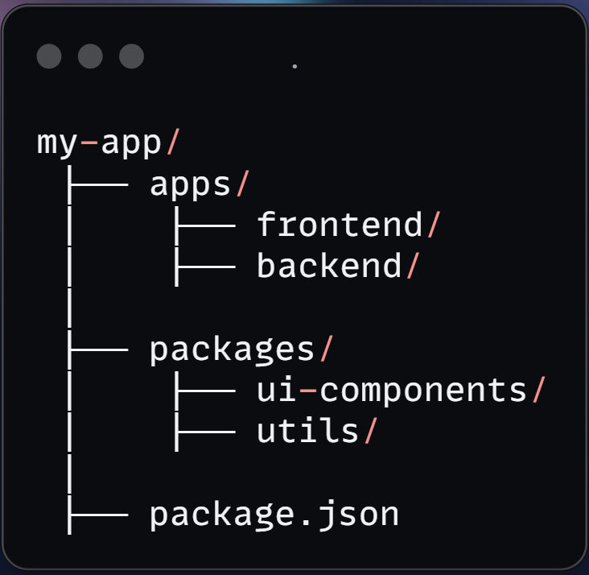

# Full Stack Interview Questions & Answers

---

## 📑 Table of Contents


<!-- ### 🌐 Basics / Web Fundamentals -->


### 🌍 Networking (DNS, HTTP, HTTPS, CORS)

- [1. What is DNS?](#1-what-is-dns)
- [2. How Does DNS Works?](#2-how-does-dns-works)
- [3. What is the difference between HTTP and HTTPS?](#3-what-is-the-difference-between-http-and-https)
- [4. What is CORS, and how do you handle it in a web application?](#4-what-is-cors-and-how-do-you-handle-it-in-a-web-application)
- [5. How does HTTP work?](#5-how-does-http-work)
- [6. HTTP/1.1 vs HTTP/2 vs HTTP/3](#6-http11-vs-http2-vs-http3)

### 🟢 Node.js / Backend

- [1. Explain event loop in Node.js.](#1-explain-event-loop-in-nodejs)
- [2. Explain the meaning of multithreading?](#2-explain-the-meaning-of-multithreading)
- [3. How Node.js Handles Concurrency (Without Multithreading)](#3-how-nodejs-handles-concurrency-without-multithreading)
- [4. Event Loop vs Multithreading](#4-event-loop-vs-multithreading)
- [5. What is callback function.](#5-what-is-callback-function)
- [6. What is Promise and explain its states?](#6-what-is-promise-and-explain-its-states)
- [7. What is Async/Await?](#7-what-is-asyncawait)
- [8. Explain the Restful API](#8-explain-the-restful-api)
- [9. HTTP Methods](#9-http-methods)
- [10. What is Authentication and Authorization?](#10-what-is-authentication-and-authorization)
- [11. What is the purpose of package.json in a Node.js project?](#11-what-is-the-purpose-of-packagejson-in-a-nodejs-project)
- [12. Describe the concept of MVC architecture](#12-describe-the-concept-of-mvc-architecture)
- [13. WebSockets and HTTP](#13-websockets-and-http)
- [14. Short Polling & Long Polling & WebSockets](#14-short-polling-long-polling-websockets)
- [15. What is SSE?](#15-what-is-sse)
- [16. What is web hooks](#16-what-is-web-hooks)
- [17. Explain the crypto module in Node.js](#17-explain-the-crypto-module-in-nodejs)
- [18. What is .body-parser in Node.js?](#18-what-is-body-parser-in-nodejs)
- [19. What is Middleware in Express?](#19-what-is-middleware-in-express)
- [20. req.params vs req.query vs req.body](#20-reqparams-vs-reqquery-vs-reqbody)
- [21. What is GraphQL](#21-what-is-graphql)
- [22. HTTP status codes](#22-http-status-codes)
- [23. What is Server-Sent Events (SSE)?](#23-what-is-server-sent-events-sse)
- [24. SSE vs WebSocket](#24-sse-vs-websocket)

### 🗄️ Database (SQL, NoSQL, ACID, Indexing)

- [1. What is normalization and denormalization.](#1-what-is-normalization-and-denormalization)
- [2. Normal Forms (1NF, 2NF, 3NF)](#2-normal-forms-1nf-2nf-3nf)
- [3. What is Indexing in Database?](#3-what-is-indexing-in-database)
- [4. What are ACID Properties?](#4-what-are-acid-properties)
- [5. SQL vs NoSQL](#5-sql-vs-nosql)
- [6. Replication and Sharding](#6-replication-and-sharding)

### 🐳 DevOps (Docker, CI/CD, Nginx)

- [1. Packages manager in your Node.js](#1-packages-manager-in-your-nodejs)
- [2. Explain the role of Docker in development and deployment](#2-explain-the-role-of-docker-in-development-and-deployment)
- [3. What is Docker Compose?](#3-what-is-docker-compose)
- [4. What is multi stage docker file](#4-what-is-multi-stage-docker-file)
- [5. What is CI/CD?](#5-what-is-cicd)

### 🔐 Security (JWT, Encryption, Hashing)

- [1. Encryption, Decryption and Hashing](#1-encryption-decryption-and-hashing)
- [2. What is Plaintext and Ciphertext?](#2-what-is-plaintext-and-ciphertext)
- [3. What is a Key in Encryption?](#3-what-is-a-key-in-encryption)
- [4. What is Symmetric Encryption?](#4-what-is-symmetric-encryption)
- [5. What is Asymmetric Encryption?](#5-what-is-asymmetric-encryption)
- [6. Examples of encryption algorithms (AES, RSA)?](#6-examples-of-encryption-algorithms-aes-rsa)
- [7. Examples of hashing algorithms (MD5, SHA)?](#7-examples-of-hashing-algorithms-md5-sha)
- [8. Why is Hashing Used for Passwords?](#8-why-is-hashing-used-for-passwords)
- [9. What is Salting in Hashing?](#9-what-is-salting-in-hashing)
- [10. What is a Hash Collision?](#10-what-is-a-hash-collision)
- [11. What is a Brute Force Attack?](#11-what-is-a-brute-force-attack)
- [12. What is a Rainbow Table Attack?](#12-what-is-a-rainbow-table-attack)
- [13. How Salting Prevents Rainbow Table Attacks?](#13-how-salting-prevents-rainbow-table-attacks)
- [14. What is Public Key and Private Key?](#14-what-is-public-key-and-private-key)
- [15. What is SSL / TLS ?](#15-what-is-ssl--tls-)
- [16. What is End-to-End Encryption (E2EE)?](#16-what-is-end-to-end-encryption-e2ee)
- [17. What is Key Exchange (Diffie-Hellman)?](#17-what-is-key-exchange-diffie-hellman)
- [18. How do you store passwords securely in a database?](#18-how-do-you-store-passwords-securely-in-a-database)
- [19. How to implement password hashing in Node.js?](#19-how-to-implement-password-hashing-in-nodejs)
- [20. How does JWT signing work?](#20-how-does-jwt-signing-work)
- [21. How do you secure API data?](#21-how-do-you-secure-api-data)
- [22. What is OAuth?](#22-what-is-oauth)
- [23. What is XSS and how to prevent it?](#23-what-is-xss-and-how-to-prevent-it)
- [24. What is CSRF?](#24-what-is-csrf)
- [25.  How does Content Security Policy (CSP) work?](#25-how-does-content-security-policy-csp-work)
- [26. What is Clickjacking?](#26-what-is-clickjacking)
- [27. What are common frontend attack vectors?](#27-what-are-common-frontend-attack-vectors)

### 🏗️ Redis & Nginx

- [1. What is redis ?](#1-what-is-redis)
- [2. Use case of redis](#2-use-case-of-redis)
- [3. Explain caching strategies](#3-explain-caching-strategies)
- [4. What is Nginx ?](#4-what-is-nginx)

<!-- ### 📡 API & Communication -->


### 🖥️ Browser / DOM / HTML / CSS

- [1. What is DOM?](#1-what-is-dom)
- [2. What is Virtual DOM?](#2-what-is-virtual-dom)
- [3. What is HTML?](#3-what-is-html)
- [4. What is CSS?](#4-what-is-css)
- [5. Why is semantic HTML important beyond SEO?](#5-why-is-semantic-html-important-beyond-seo)
- [6. What are reflow and repaint?](#6-what-are-reflow-and-repaint)
- [7. preload vs prefetch vs preconnect](#7-preload-vs-prefetch-vs-preconnect)
- [8. How does HTML structure affect performance?](#8-how-does-html-structure-affect-performance)
- [9. Button vs Anchor](#9-button-vs-anchor)
- [10. What is ARIA? What problems does ARIA solve?](#10-what-is-aria-what-problems-does-aria-solve)
- [11. How does HTML impact screen readers?](#11-how-does-html-impact-screen-readers)
- [12. Flexbox and Grid](#12-flexbox-and-grid)

### ⚛️ React

- [1. What is react ?](#1-what-is-react)
- [2. How does React.js work?](#2-how-does-reactjs-work)
- [3. What is JSX?](#3-what-is-jsx)
- [4. What is a React component?](#4-what-is-a-react-component)
- [5. What are props ?](#5-what-are-props)
- [6. What is state in React ?](#6-what-is-state-in-react)
- [7. What are fragments in React?](#7-what-are-fragments-in-react)
- [8. What is controlled and uncontrolled components?](#8-what-is-controlled-and-uncontrolled-components)
- [9. What is react life cycle ?](#9-what-is-react-life-cycle)
- [10. What are Hooks in React ?](#10-what-are-hooks-in-react)
- [11. React Hooks](#11-react-hooks)
- [12. Explain useMemo and useCallback](#12-explain-usememo-and-usecallback)
- [13. What is State Management in React and what is the difference between Local and Global State?](#13-what-is-state-management-in-react-and-what-is-the-difference-between-local-and-global-state)
- [14. What are some popular state management solutions in React/Next.js?](#14-what-are-some-popular-state-management-solutions-in-reactnextjs)
- [15. When should you use Redux over Context API?](#15-when-should-you-use-redux-over-context-api)
- [16.  Explain the Context API and useReducer in React.](#16-explain-the-context-api-and-usereducer-in-react)
- [17. What is the difference between Client State and Server State?](#17-what-is-the-difference-between-client-state-and-server-state)
- [18. HTTP Caching Basics](#18-http-caching-basics)
- [19. Cache-Control Headers](#19-cache-control-headers)
- [20. ETag & Last-Modified (Cache Validation)](#20-etag--last-modified-cache-validation)
- [21. What is CDN and CDN cache](#21-what-is-cdn-and-cdn-cache)
- [22. Cache Invalidation Strategies](#22-cache-invalidation-strategies)
- [23. LocalStorage vs SessionStorage vs Cookies](#23-localstorage-vs-sessionstorage-vs-cookies)
- [24. What is IndexedDB?](#24-what-is-indexeddb)
- [25. How do you handle asynchronous state updates in React?](#25-how-do-you-handle-asynchronous-state-updates-in-react)
- [26. what is React.memo ?  How does React.memo help improve performance?](#26-what-is-reactmemo-how-does-reactmemo-help-improve-performance)
- [27. If I ask you to optimize a slow React application, what techniques would you use?](#27-if-i-ask-you-to-optimize-a-slow-react-application-what-techniques-would-you-use)
- [28. What is the difference between React.PureComponent and React.Component?](#28-what-is-the-difference-between-reactpurecomponent-and-reactcomponent)
- [29. What is prop drilling?](#29-what-is-prop-drilling)
- [30. What is Throttling?](#30-what-is-throttling)
- [31. What is Debouncing ?](#31-what-is-debouncing)
- [32. Why is the key prop important in React lists?](#32-why-is-the-key-prop-important-in-react-lists)
- [33. What happens if we use the array index as a key in React?](#33-what-happens-if-we-use-the-array-index-as-a-key-in-react)
- [34. What is React Router and why is it used?](#34-what-is-react-router-and-why-is-it-used)
- [35. Explain the difference between client-side and server-side programming?](#35-explain-the-difference-between-client-side-and-server-side-programming)
- [36. What is the difference between client-side routing and server-side routing?](#36-what-is-the-difference-between-client-side-routing-and-server-side-routing)
- [37. What is Sever Side Rendering and Client Side Rendering](#37-what-is-sever-side-rendering-and-client-side-rendering)
- [38. What are React Server Components?](#38-what-are-react-server-components)
- [39. Static Site Generation (SSG)](#39-static-site-generation-ssg)
- [40. What is Hydration?](#40-what-is-hydration)

<!-- ### 🖥️ HTML / CSS / Browser -->


### 💛 JavaScript Core

- [1. How hoisting works?](#1-how-hoisting-works)
- [2. What is TDZ (Temporal Dead Zone)?](#2-what-is-tdz-temporal-dead-zone)
- [3. What is the difference between var, let, and const?](#3-what-is-the-difference-between-var-let-and-const)
- [4. Microtasks vs Macrotasks](#4-microtasks-vs-macrotasks)
- [5. How garbage collection works?](#5-how-garbage-collection-works)
- [6. What causes memory leaks?](#6-what-causes-memory-leaks)
- [7. How ‘this’ behaves?](#7-how-this-behaves)
- [8. What are closures?](#8-what-are-closures)
- [9. What is lexical environment ?](#9-what-is-lexical-environment)

### 🔷 TypeScript

- [1. What are generics types?](#1-what-are-generics-types)
- [2. Interface vs Type](#2-interface-vs-type)

### ⚡ Performance & Web Vitals

- [1. What are Web Vitals (LCP, CLS, INP)?](#1-what-are-web-vitals-lcp-cls-inp)
- [2. How do you reduce Time To Interactive (TTI)?](#2-how-do-you-reduce-time-to-interactive-tti)
- [3. Code Splitting (Lazy Loading)](#3-code-splitting-lazy-loading)
- [4. How do images impact performance? How do images impact performance?](#4-how-do-images-impact-performance-how-do-images-impact-performance)
- [5. What is WCAG?](#5-what-is-wcag)

<!-- ### ♿ Accessibility -->


### 🔧 Build Tools & Bundlers

- [1. How do bundlers work?](#1-how-do-bundlers-work)
- [2. Vite vs Webpack vs Rollup](#2-vite-vs-webpack-vs-rollup)
- [3. What does Babel do?](#3-what-does-babel-do)
- [4. How does Hot Module Replacement (HMR) work?](#4-how-does-hot-module-replacement-hmr-work)
- [5. What is a Monorepo?](#5-what-is-a-monorepo)

### 🧪 Testing

- [1. What is the Test Pyramid?](#1-what-is-the-test-pyramid)
- [2. Unit vs Integration vs E2E](#2-unit-vs-integration-vs-e2e)
- [3. What is mock in testing ?](#3-what-is-mock-in-testing)
- [4. What should NOT be tested?](#4-what-should-not-be-tested)

### 📐 Architecture & Design Patterns

- [1. What is Component-Driven Development (CDD)?](#1-what-is-component-driven-development-cdd)
- [2. What is Atomic Design?](#2-what-is-atomic-design)
- [3. What are Micro-frontends?](#3-what-are-micro-frontends)
- [4. What is Semantic versioning (SemVer)?](#4-what-is-semantic-versioning-semver)

<!-- <br><br> -->
<!-- --- -->


<!-- # 🌐 Basics / Web Fundamentals -->
<!-- <br><br> -->


<br><br>
---


# 🌍 Networking (DNS, HTTP, HTTPS, CORS)
<br><br>


## **1. What is DNS?**

DNS is a **hierarchical and distributed naming system** that translates domain names into IP addresses. When you type a domain name like  into your browser, DNS ensures that the request reaches the correct server by resolving the domain to its corresponding .

Without DNS, we’d have to remember the numerical IP address of every website we want to visit, which is highly impractical. DNS simplifies the process by allowing us to use user-friendly names while still maintaining the performance and scalability required for modern internet operations.


---


## **2. How Does DNS Works?**




1. **User Input**: You enter a website address (for example, www.geeksforgeeks.org) into your web browser.

2. **Local Cache Check**: Your browser first checks its local cache to see if it has recently looked up the domain. If it finds the corresponding IP address, it uses that directly without querying external servers.

3. **DNS Resolver Query**: If the IP address isn’t in the local cache, your computer sends a request to a DNS resolver. The resolver is typically provided by your Internet Service Provider (ISP) or your network settings.

4. **Root DNS Server**: The resolver sends the request to a root . The root server doesn’t know the exact IP address for www.geeksforgeeks.org but knows which Top-Level Domain (TLD) server to query based on the domain’s extension (e.g., .org).

5. **TLD Server**: The TLD server for .org directs the resolver to the authoritative DNS server for geeksforgeeks.org.

6. **Authoritative DNS Server**: This server holds the actual DNS records for geeksforgeeks.org, including the IP address of the website’s server. It sends this IP address back to the resolver.

7. **Final Response**: The DNS resolver sends the IP address to your computer, allowing it to connect to the website’s server and load the page.


---


## **3. What is the difference between HTTP and HTTPS?**


| HTTP | HTTPS |
| --- | --- |
| HTTP stands for HyperText Transfer Protocol. In HTTP, the URL begins with “http://”. | HTTPS stands for HyperText Transfer Protocol Secure. In HTTPS, the URL starts with “https://”. |
| HTTP uses port number 80 for communication. | HTTPS uses port number 443 for communication. |
| Hyper-text exchanged using HTTP goes as plain text i.e. anyone between the browser and server can read it relatively easily if one intercepts this exchange of data and due to which it is Insecure. | HTTPS is considered to be secure but at the cost of processing time because Web Server and Web Browser need to exchange encryption keys using Certificates before actual data can be transferred. |
| HTTP does not use encryption, which results in low security in comparison to HTTPS. | HTTPS uses Encryption which results in better security than HTTP. |
| HTTP speed is faster than HTTPS. | HTTPS speed is slower than HTTP. |


---


## **4. What is CORS, and how do you handle it in a web application?**

**CORS** (Cross-Origin Resource Sharing) controls access to resources from a different origin (domain, protocol, or port).

**Handling CORS**:  
**Backend**: Set headers to allow specific origins.


---


## **5. How does HTTP work?**

HTTP is a request-response protocol where the client sends a request to the server, and the server responds with data.

- Client (browser) sends request 
- Server processes it 
- Server sends response 
- Browser renders data


---


## **6. HTTP/1.1 vs HTTP/2 vs HTTP/3**


**HTTP/1.1**  

One request at a time per connection (mostly)

Request → Response → Request → Response

**🔴 Problem: Head-of-Line Blocking**  
Request 1 (slow)  
Request 2 (waiting…)  
Request 3 (waiting…)  
👉 Everything waits ❌

**🔧 Workaround (used in old days)**
- Multiple TCP connections (6 per domain) 
- Domain sharding 

**❌ Limitations**
- Slow for modern apps 
- Too many connections 
- Inefficient 

**HTTP/2**  

Multiple requests over **one connection**

[Req1 Req2 Req3]  
             ↓  
Shared connection (TCP)  
             ↓  
If one packet lost → ALL wait ❌

**✅ Benefits**
- Faster loading ⚡ 
- No need for multiple connections 
- Efficient 

**🔥 Other Features**  

**🔹 1. Binary Protocol**  
👉 More efficient than text-based HTTP/1.1

**🔹 2. Header Compression (HPACK)**  
👉 Reduces repeated headers

**🔹 3. Server Push (less used now)**  
👉 Server can send resources before request


**⚠️ Still has a problem**  
👉 Uses **TCP**  
👉 TCP still has **Head-of-Line blocking at transport level**

**HTTP/3**  

HTTP/3 allows each request to travel independently, so one slow request doesn’t block others.     
**Uses QUIC (UDP)**  👉 No TCP → no transport-level blocking

[Req1] → independent stream  
[Req2] → independent stream  
[Req3] → independent stream

If Req2 fails:
→ Req1 & Req3 continue ✅

**✅ Benefits**

**🔹 1. No Head-of-Line Blocking**  
👉 One slow request ≠ affects others  

**🔹 2. Faster Connection Setup**  
👉 0-RTT (zero round-trip time)

**🔹 3. Better for Mobile Networks**  
👉 Handles packet loss better 📶

**🔹 4. Built-in Encryption**  
👉 Always HTTPS 🔒
**🧠 Think of this like a food delivery system 🍔**  
<br></br>
**🐢 HTTP/1.1 (Single Delivery Guy)**  
You order 3 items:

🍔 Burger
🍟 Fries
🥤 Drink

Delivery flow:

Order Burger → wait → delivered  
Order Fries → wait → delivered  
Order Drink → wait → delivered  
👉 Only **one order at a time**

**❌ Problem**  
Burger is late → EVERYTHING is delayed 😤  
👉 This is **Head-of-Line Blocking**

<br></br>
**⚡ HTTP/2 (One Delivery Guy, Multiple Bags)**  
You order 3 items:

🍔 Burger
🍟 Fries
🥤 Drink

Delivery flow:

All packed together → same trip → arrive together

**🧠 Better**   
👉 Multiple items handled **in parallel**

**⚠️ Still a problem**  
If road is blocked 🚧 → whole delivery is delayed  
👉 Because still using **TCP (single path)**

<br></br>
**🚀 HTTP/3 (Multiple Delivery Bikes)**  
You order 3 items:

🍔 Burger → Bike 1
🍟 Fries → Bike 2
🥤 Drink → Bike 3

**🎯 Delivery flow**
Bike 1 → arrives  
Bike 2 → stuck in traffic 🚧  
Bike 3 → arrives  

👉 You still get:  
Burger ✅  
Drink ✅  
Fries later  
<br></br>

| Feature | HTTP/1.1 | HTTP/2 | HTTP/3 |
| --- | --- | --- | --- |
| Protocol | TCP | TCP | UDP (QUIC) |
| Multiplexing | ❌ No | ✅ Yes | ✅ Yes |
| Head-of-line blocking | ❌ Yes | ⚠️ Partial | ✅ No |
| Speed | Slow | Fast ⚡ | Faster ⚡⚡ |
| Encryption | Optional | Optional | Mandatory 🔒 |  

<br><br>

---


# 🟢 Node.js / Backend
<br><br>

## **1. Explain event loop in Node.js.**

**Short Answer (Best for interviews)**  
Node.js uses a single-threaded, non-blocking architecture. The event loop is what allows Node.js to handle multiple operations asynchronously without creating multiple threads.  

It continuously checks the call stack and callback queue. If the call stack is empty, it takes tasks from the queue and executes them.

JavaScript is single-threaded, but asynchronous behavior is handled using the event loop, callbacks, and Promises.

**Event loop is the core mechanism that makes Node.js non-blocking and scalable.**

**Slightly Detailed Answer (Impress interviewer)**  
Node.js runs on a single thread, so it can execute only one task at a time. But it doesn’t block execution for I/O operations like file reading, API calls, or database queries.

Instead, it uses the event loop. When an async operation is triggered, Node.js sends it to the system (like Web APIs or libuv thread pool). Once the operation is complete, its callback is placed in a queue.  

The event loop keeps checking:
- If the call stack is empty 
- Then it pushes tasks from the queue to the stack 

This is how Node.js handles thousands of concurrent requests efficiently.

**Simple Example (Always good to add)**

console.log("Start");  

setTimeout(() => {  
  console.log("Timeout");  
}, 0);  

console.log("End");

**Output:**  
Start  
End  
Timeout  




---


## **2. Explain the meaning of multithreading?**

Multithreading is a concept where multiple threads execute tasks simultaneously within a single process, allowing better performance and efficient use of CPU.

Multithreading allows concurrent execution of tasks, improving performance and responsiveness of applications.

Ex- Like a restaurant kitchen where multiple chefs (threads) work on different dishes at the same time instead of one chef doing everything.


---


## **3. How Node.js Handles Concurrency (Without Multithreading)**

Node.js is single-threaded, but it handles concurrency using the event loop and background workers (libuv).

Node.js achieves concurrency using the event loop and non-blocking I/O operations instead of creating multiple threads for each request.


---


## **4. Event Loop vs Multithreading**

Multithreading runs tasks in parallel using multiple threads, while the event loop handles concurrency in a single thread using non-blocking operations.


---


## **5. What is callback function.**

A callback function is a function that is passed as an argument to another function.

In real applications, we often use two callbacks — one for success and one for error.

```javascript
function sayBye() {
  console.log("Goodbye!");
}

function greet(name, callback) {
  console.log("Hello " + name);
  callback(); // calling the callback function
}

greet("Tirth", sayBye);
```

**Output**  
Hello Tirth  
Goodbye!

**Callback hell is a situation where multiple callbacks are nested inside each other, making the code hard to read, maintain, and debug.**  


```javascript
function successCb(message, data) {
    console.log("✅ SUCCESS:", message);
    if (data) console.log("Data:", data);
}

function errorCb(errorMessage) {
    console.log("❌ ERROR:", errorMessage);
}

function fetchProjects(onSuccess, onError) {
    if ( Math.random() > 0.5 ) {
        onSuccess("Projects fetched", projects);
    } else {
        onError("No projects found");
    }
}

fetchProjects(successCb, errorCb);
```


---


## **6. What is Promise and explain its states?**

A Promise in JavaScript is an object that represents the result of an asynchronous operation
- **Pending:** In its initial state, neither fulfilled nor rejected.
- **Fulfilled:** Indicating that the operation was successful.
- **Rejected:** Indicating that the operation failed.  
doTask1()  
.then(() => doTask2())  
.then(() => doTask3())  
.then(() => console.log("Done"))  
.catch((err) => console.log(err));  

```js
const myPromise = new Promise((resolve, reject) => {
  let success = true;

  if (success) {
    resolve("Task completed!");
  } else {
    reject("Task failed!");
  }
});

myPromise
  .then((result) => {
    console.log(result); // fulfilled
  })
  .catch((error) => {
    console.log(error); // rejected
  });
```


---


## **7. What is Async/Await?**

Async/await is built on top of Promises and helps write cleaner, more readable asynchronous code.  
We can only use await inside an async function.  
async → makes a function return a Promise  
await → pauses the execution until the Promise is resolved


---


## **8. Explain the Restful API**

REST API stands for REpresentational State Transfer API  
API (Application Programming Interface)  

It is a type of API that allows communication between different systems over the internet.  
REST APIs work by sending requests and receiving responses, typically in JSON format, between the client and server.  
REST APIs use **HTTP methods** (such as GET, POST, PUT, DELETE) to define actions that can be performed on resources.  
These methods align with **CRUD** operations, which are used to manipulate resources over the web.  


---


## **9. HTTP Methods**

  GET → Read   
  POST → Create   
  PUT → Update (full)   
  PATCH → Update (partial)   
  DELETE → Remove  

  HEAD → Same as GET but returns only headers, no body.  
  OPTIONS → Tells which HTTP methods are allowed on a resource. Used in **CORS**  
  CONNECT → Used to establish a tunnel (mainly for HTTPS).  
  TRACE → Used for debugging — returns the request back.  


---


## **10. What is Authentication and Authorization?**

**Authentication** is the process of verifying who the user is (verifying user identity)  
**Authorization** is the process of determining what the user is allowed to do.  
**Authentication**: Who are you?  
**Authorization**: What are you allowed to do?  


---


## **11. What is the purpose of package.json in a Node.js project?**


It has multiple uses.  
It defines the project's metadata, like its name, version, and description.  
It also lists the dependencies and devDependencies required to run or develop the application  
as well as scripts for tasks like building, testing, or running the app


---


## **12. Describe the concept of MVC architecture**

🔹 **Model (Data Layer)**  
👉 “Handles data and business logic.”  
- Interacts with database   
- Manages data   

Example: User schema, DB queries

🔹 **View (UI Layer)**  
👉 “Responsible for displaying data to the user.”  
- UI / frontend   
- Shows data   

Example: HTML, React UI

🔹 **Controller (Logic Layer)**  
👉 “Acts as a bridge between Model and View.”  
- Handles requests   
- Processes data   
- Sends response  

🎯 Key Benefits  
- Clean code structure   
- Easy to maintain   
- Scalable   
- Separation of concerns  

In modern apps like MERN, React handles the View, Node/Express acts as Controller, and MongoDB is the Model layer.

Flow –  User →  View → Controller → Model → Controller → View → User 


---


## **13. WebSockets and HTTP**


**🔹 HTTP**  
HTTP is a request-response protocol where the client requests data and the server responds

- Request → Response cycle 
- Connection closes after response 
- Client must request again for new data

**🔹WebSocket**  
WebSocket is a full-duplex protocol that allows real-time, two-way communication between client and server.

- One-time connection setup 
- Real-time data exchange 
- Server can also send data anytime

---


## **14. Short Polling & Long Polling & WebSockets**

Polling and WebSockets are techniques used for client-server communication.  
Polling repeatedly asks the server for updates  
WebSockets maintain a persistent connection for real-time communication.  

🔹 **Short Polling**  
In short polling, the client continuously sends requests to the server at regular intervals to check for updates.  

**💡** How it works  
- Client → request every few seconds   
- Server → responds (with or without new data)  

**📌** Example:  Checking notifications every 5 seconds  

**⚠️** Problem  
- Too many unnecessary requests   
- Wastes bandwidth   

🔹 **Long Polling**  
In long polling, the client sends a request and the server holds it until new data is available, then responds.  

📌 Example  
👉 Chat apps (before WebSockets)

💡 How it works  
- Client sends request   
- Server waits (does NOT respond immediately)   
- When data is ready → sends response 
- Client sends new request again 

**⚠️** Problem
- Still creates repeated connections 
- Higher latency than WebSockets

🔹**WebSocket**     
WebSocket creates a persistent connection where both client and server can send data anytime.

💡 How it works  
- One-time connection   
- Continuous 2-way communication   

📌 Example  
👉 WhatsApp, live trading apps


---


## **15. What is SSE?**

SSE (Server-Sent Events) allows the server to send data to the client continuously over a single HTTP connection.

SSE is like an improved version of long polling  
👉 SSE = **Server → Client only**
- Server can push updates 
- Client cannot send data back through same connection   

**⚙️ How it works**
- Client makes HTTP request 
- Server keeps connection open 
- Server keeps sending updates


---


## **16. What is web hooks**

A webhook is a way for one application to send real-time data to another application automatically when a specific event occurs.

**How it works (Step-by-step)**
- You provide a **URL (endpoint)** 
- An event happens (e.g., payment success) 
- Server sends an **HTTP POST request** to your URL 
- Your server receives and processes the data 

**Real Example**
👉 Payment gateway (like Razorpay/Stripe):
- User makes payment 
- Payment is successful 
- Payment service sends webhook to your backend

Webhooks should be secured using signatures or secret keys to verify that the request is coming from a trusted source.


---


## **17. Explain the crypto module in Node.js**

The crypto module is used for encrypting, decrypting, or hashing any type of data.

The main use case of the crypto module is to convert the plain readable text to an encrypted format and decrypt it when required.


---


## **18. What is .body-parser in Node.js?**

body-parser is a middleware in Node.js (Express) used to parse incoming request bodies so we can access data sent by the client in req.body.

By default → Express **cannot read it directly** ❌  
body-parser → converts it into usable format ✅


---


## **19. What is Middleware in Express?**

Middleware is a function that runs between the request and the response cycle, and it can modify the request, response, or end the request.

👉 Flow: **Request → Middleware → Route Handler → Response**

Middleware functions process requests before they reach the route handler and can modify request/response or control the flow.

Middleware can:
- Read/modify req and res 
- Execute logic (auth, logging, validation) 
- Call next() to pass control


---


## **20. req.params vs req.query vs req.body**


### **🔹 req.params** 

👉 Used to get data from **URL path** variables  
**📌** Example  
```js
     app.get("/user/:id", (req, res) => {
         console.log(req.params.id);
     });
```
👉 URL:  /user/101              👉 Output:  101


### **🔹 req.query**  

👉 Used to get data from **query string** (URL after ?).  
**📌** Example  
```js
     app.get("/search", (req, res) => {
         console.log(req.query.name);
     });
```
👉 URL:  /search?name=tirth          👉 Output:  tirth


### **🔹 req.body**  

👉 Used to get data sent in **request body** (POST/PUT/PATCH).  
**📌** Example  
```js
     app.post("/user", (req, res) => {
         console.log(req.body.name);
     });
```
👉 Body:  { "name": "Tirth" }        👉 Output:  Tirth

---

## **21. What is GraphQL**

GraphQL is a query language for APIs that allows clients to request only the data they need.

- REST → /users, /posts, /comments 
- GraphQL → **single endpoint** 

👉 Client decides **what data to fetch** ✅

**🔹 1. Avoid Over-fetching**  
👉 Get only required data  

**🔹 2. Avoid Under-fetching**  
👉 No need for multiple API calls

GraphQL is especially useful in frontend-heavy applications where minimizing API calls is important.

## **22. HTTP status codes**

- Informational responses (100 – 199)
- Successful responses (200 – 299)
- Redirection messages (300 – 399)
- Client error responses (400 – 499)
- Server error responses (500 – 599)

<br>

100 Continue	                  

200 OK  
201 Created  

304 Not Modified  
307 Temporary Redirect  
308 Permanent Redirect  

400 Bad Request  
401 Unauthorized  
403 Forbidden  
404 Not Found  
409 Conflict  
429 Too Many Requests  

500 Internal Server Error 


---


## **23. What is Server-Sent Events (SSE)?**

Server-Sent Events (SSE) is a technology that allows the server to push real-time updates to the client over a single HTTP connection.

👉 Client opens a connection → server keeps sending updates

- One-way communication (server → client) 
- Uses normal HTTP 
- Connection stays open

**📌 Example Use Cases**

- Live notifications 
- News feeds 
- Stock price updates
- Chat gpt


---


## **24. SSE vs WebSocket**

SSE is one-way (server to client)  
WebSocket is two-way (bidirectional).

| Feature | SSE | WebSocket |
| --- | --- | --- |
| Communication | One-way | Two-way (full-duplex) |
| Protocol | HTTP | WebSocket (ws://) |


<br><br>
---

# 🗄️ Database (SQL, NoSQL, ACID, Indexing)
<br><br>


## **1. What is normalization and denormalization.**


**Normalization** – Normalization removes duplicate data by splitting it into multiple related tables.
- Reduce redundancy

```js
USER                               ORDER             
                             
{                                  {              
"userId":1,                        "orderId": 1,
"name":"Tirth",                    "userId": 1,
"email": "test@gmail.com"          }                         
}
```  

**Denormalization** - Denormalization combines data into a single table to reduce joins and improve read performance.
- Faster queries
- Fewer joins

```js
{
  "orderId": 1,
  "userName": "Tirth",
  "userEmail": "test@gmail.com"
}
```

In real-world systems, we often use a balance of both — normalized design for consistency and selective denormalization for performance optimization.


---


## **2. Normal Forms (1NF, 2NF, 3NF)**


### **🔹 1NF (First Normal Form)**    
❌ Problem: Multiple values in one column  

```js
{
"studentId": 1,
"name": "Tirth",
"courses": ["Math", "Science"]  // multiple values ❌ Not atomic
}
```

✅ Solution (1NF)  

```js
{ "studentId": 1, "name": "Tirth", "course": "Math" }
{ "studentId": 1, "name": "Tirth", "course": "Science" }
```

### **🔹 2NF (Second Normal Form)**
❌ Problem: Partial Dependency  

```js
{
  "studentId": 1,
  "course": "Math",
  "studentName": "Tirth"
}
```

👉 Problem:
- studentName depends only on studentId 
- Not on full key (studentId + course) ❌


✅ Solution (2NF)

```js
Students Table
{ "studentId": 1, "studentName": "Tirth" }

Enrollments Table
{ "studentId": 1, "course": "Math" }
```

### **🔹 3NF (Third Normal Form)**
❌ Problem: Transitive Dependency

```js
{
  "studentId": 1,
  "course": "Math",
  "teacher": "Mr. A",
  "teacherPhone": "999999"
}
```

👉 Problem:
- teacherPhone depends on teacher 
- Not directly on studentId ❌

✅ Solution (3NF)

```js
Teachers Table
{ "teacher": "Mr. A", "teacherPhone": "999999" }

Enrollments Table	
{ "studentId": 1, "course": "Math", "teacher": "Mr. A" }
```

<br>

| Normal Form | What it removes | Simple Meaning |
| --- | --- | --- |
| 1NF | Repeating data | No arrays |
| 2NF | Partial dependency | Depends on full key |
| 3NF | Transitive dependency | No indirect dependency |


---


## **3. What is Indexing in Database?**


Indexing is a technique used to improve the speed of data reads by creating a separate data structure that allows faster searching.

- Improves **read speed**
- Slightly slows **write operations** (insert/update)

Index improves read performance but adds overhead to write operations.


---


## **4. What are ACID Properties?**


ACID ensures reliable and consistent database transactions.

### **🔹 A — Atomicity**
- Transaction is all or nothing.

**❌ Problem (without atomicity)**
- Money deducted from A ✅ 
- Not added to B ❌ 
👉 Money lost 😨

**✅ With Atomicity**
- Deduct + Add both succeed ✅ 
- OR both fail ❌


### **🔹 C — Consistency**
- Database remains in a valid state.

Consistency is enforced by:
- Constraints (UNIQUE, NOT NULL, CHECK) 
- Foreign keys 
- Business rules


### **🔹 I — Isolation**
- Transactions don’t interfere with each other.

**❌ Without Isolation**
- Transaction A reads → 1000 
- Transaction B reads → 1000 
- A withdraws 500 → balance = 500 
- B withdraws 700 → balance = -200 ❌ 

**✅ With Isolation**
- One transaction completes first 
- Second sees updated balance 
👉 No wrong deduction ✅


### **🔹 D — Durability**
- Once committed, data is permanently saved.

Once a transaction is committed, it will NOT be lost — even if the system crashes.

**🔥 Example**
- User pays ₹500 
- Transaction → **COMMIT** ✅ 
- Server crashes 💥 
👉 After restart:
- Payment is still recorded ✅ 
👉 That’s **Durability**


---


## **5. SQL vs NoSQL**


| Feature | SQL | NoSQL |
| --- | --- | --- |
| Structure | Tables | Documents (JSON-like) |
| Schema | Fixed | Flexible |
| Relationships | Strong (JOIN) | Weak / embedded |
| Data integrity | High (ACID) | Medium |
| Scaling | Vertical | Horizontal |
| Query | SQL language | JSON-like queries |

<br>

**SQL –**  

✅ Best For
- Banking systems 💰 
- Payment systems 
- Inventory 
- Systems requiring accuracy + consistency   

⚠️ Limitation
- Hard to change structure 
- Scaling is harder

<br>

**NO SQL –**  

✅ Best For
- Real-time apps (chat, feeds) 
- Social media 
- Analytics 
- Rapid development  

⚠️ Limitation
- Data duplication 
- Hard to maintain consistency

    **🚫 No Joins (Mostly)**  
      Data is often **embedded**  
      Instead of joining tables: You store related data together   


## **6. Replication and Sharding**

**Replication (Copying Database)**  
Replication = making copies of your database  
Load is distributed 🚀

```js
         MainDB (Write)
        /	  |	     \
    ReadDB  ReadDB  ReadDB
```

Main DB → handles **WRITE** (insert/update)   
Replicas → handle **READ** (select queries)

✅ Benefits
- Faster reads ⚡ 
- Handles more users 
- Simple to implement  

⚠️ Limitation
- Slight delay (replication lag) 
- Only main DB can write

**Sharding (Splitting Database)**  
Sharding = dividing data across multiple databases  
Each DB handles **part of data**

🔧 How it works  
Shard 1 → Users 1–1000  
Shard 2 → Users 1001–2000  
Shard 3 → Users 2001–3000  

✅ Benefits
- Handles massive data 
- True horizontal scaling 
- High performance 

⚠️ Limitation
- Complex to manage 😅 
- Hard joins across shards ❌


<br><br>
---


# 🐳 DevOps (Docker, CI/CD, Nginx)
<br>

## **1. Packages manager in your Node.js**

A package manager in a Node.js project is a tool used to install, manage, and maintain project dependencies.

Package managers help manage dependencies, versions, and scripts in a Node.js project.  

Ex –  npm, Yarn, pnpm 

**Dependencies** are required to run the app in production  
**DevDependencies** are only needed during development.


---


## **2. Explain the role of Docker in development and deployment**

Docker is a containerization tool that allows developers to package an application along with its dependencies into a container, ensuring it runs consistently across different environments.

👉 **Docker solves the ‘it works on my machine’ problem.**
- Same code 
- Same dependencies 
- Same environment   

👉 Runs the same everywhere ✅

**✅ Role in Development**  

**🔹 1. Consistent Environment**
- Same Node version, same DB 
- No setup issues 


**🔹 2. Easy Setup**  
👉 Run app with one command:  **docker-compose up**

**🔹 3. Isolation**
- Each project runs in its own container 
- No conflicts between projects 

**🔹 4. Team Collaboration**
- Everyone uses same environment 
- No “works on my machine” issue

**✅ Role in Deployment**  

**🔹 1. Easy Deployment**  
👉 Build once, run anywhere

**🔹 2. Scalability**
- Can run multiple containers 
- Used in microservices 

**🔹 3. Faster Deployment**
- No need to install dependencies again 

**🔹 4. Cloud Friendly**
- Works with AWS, Azure, etc.

---

## **3. What is Docker Compose?**

Docker Compose is a tool used to define and run multiple containers together using a single configuration file.

👉 Instead of running containers one by one:  
❌ Backend    ❌ Database    ❌ Redis

👉 You define everything in one file:  
✅ Run all with **one command** :   **docker-compose up**

**✅ Why We Use Docker Compose**    

**🔹 1. Manage Multiple Services**
- Backend (Node.js) 
- Database (PostgreSQL / MongoDB) 
- Redis 

**🔹 2. Easy Setup**  
**docker-compose.yml**    => This file defines all services  
👉 One command:  **docker-compose up**

**🔹 3. Networking Built-in**
- Containers can talk to each other easily 

**🔹 4. Environment Management**
- Define env variables 
- Same setup for all developers 

---


## **4. What is multi stage docker file**

A multi-stage Dockerfile is a Dockerfile that uses multiple build stages to create a smaller and optimized final image by separating build and runtime environments.

Multi-stage Dockerfiles help reduce image size and improve security by separating build and runtime environments.

👉 Instead of putting everything in one image:
- Stage 1 → Build app (install dev dependencies, compile) 
- Stage 2 → Run app (only required files)   

👉 Final image = **clean + lightweight** ✅

**✅ Why We Use Multi-Stage Dockerfile**

**🔹 1. Smaller Image Size**
- Removes unnecessary files (node_modules dev, build tools) 

**🔹 2. Better Security**
- No dev tools in production image 

**🔹 3. Faster Deployment**
- Smaller image → faster pull & run 

**🔹 4. Clean Separation**
- Build stage ≠ Runtime stage

**✅ How It Works**
- First stage → builds app 
- Second stage → copies only needed files 
- Final image → optimized


**✅ Example (Multi-Stage Dockerfile)**


```dockerfile
# ---------- Stage 1: Build ----------
FROM node:20 AS builder

WORKDIR /app

COPY package*.json ./
RUN npm install

COPY . .
RUN npm run build

# ---------- Stage 2: Production ----------
FROM node:20-slim

WORKDIR /app

COPY --from=builder /app/dist ./dist
COPY package*.json ./

// -- Use this only if copy the node module
// -- It will remove all dev devDependencies
// COPY --from=builder /app/node_modules ./node_modules
// RUN npm prune --production

RUN npm install --only=production

CMD ["node", "dist/index.js"]
```


**✅ Simple Dockerfile (Without Multi-Stage)**


```dockerfile
FROM node:20

WORKDIR /app

COPY . .
RUN npm install
RUN npm run build

CMD ["node", "dist/index.js"]
```


**❌ Problem:**
- Includes dev dependencies 
- Larger image 
- Less secure

**✅ Key Differences**

| Feature | Simple Dockerfile | Multi-Stage Dockerfile |
| --- | --- | --- |
| Image Size | Large | Small |
| Build Tools | Included | Removed in final image |
| Performance | Slower | Faster |
| Security | Lower | Higher |


---


## **5. What is CI/CD?**

CI/CD stands for Continuous Integration and Continuous Deployment/Delivery.

It is a process that automates building, testing, and deploying applications.

CI/CD automates the process of integrating, testing, and deploying code, making development faster and more reliable.

CI/CD pipelines improve software quality and reduce manual work by automating the entire development lifecycle.

Developer → Push code to GitHub  
→ GitHub Actions runs (build + test Docker image)  
→ Push image to Docker Hub / ECR  
→ SSH into EC2  
→ Pull latest image  
→ Run container (deploy)


<br><br>
---


# 🔐 Security (JWT, Encryption, Hashing)
<br><br>

## **1. Encryption, Decryption and Hashing**

**Encryption** is the process of converting readable data (plain text) into unreadable data (cipher text) using a key to protect it.
- Data becomes unreadable 
- Requires a **key** to access  

👉 Example: HTTPS, secure messages

**Decryption** is the process of converting encrypted data back into its original readable form using a key.
- Reverse of encryption 
- Needs correct key 

👉 Example: Reading secured data


**Hashing** is the process of converting data into a fixed-length string using a hash function, and it cannot be reversed.
- One-way process 
- Cannot get original data back 

👉 Example: Password storage


---


## **2. What is Plaintext and Ciphertext?**

Plaintext is readable data  
Ciphertext is the encrypted unreadable form.


---


## **3. What is a Key in Encryption?**

A key is a secret value used in encryption and decryption to convert plaintext into ciphertext and vice versa.


---


## **4. What is Symmetric Encryption?**

Symmetric encryption uses the same key for both encryption and decryption.   
Encrypt → Key A   
Decrypt → Key A  


---


## **5. What is Asymmetric Encryption?**

Asymmetric encryption uses two keys: a public key and a private key  
Public key → encrypt   
Private key → decrypt  


---


## **6. Examples of encryption algorithms (AES, RSA)?**

🔹 AES (Advanced Encryption Standard)  
- Symmetric encryption  
- Fast → used for encrypting large data  
- AES is used to encrypt actual data.  

🔹 RSA  
- Asymmetric encryption  
- Uses public & private keys  
- Slower → used for securely sharing keys  
- RSA is used to exchange keys


---


## **7. Examples of hashing algorithms (MD5, SHA)?**

**🔹** MD5  
- Older hashing algorithm  
- Not secure now   
- High collision risk  
- Hackers can generate two different inputs with same hash  
- Easy for attackers to brute-force passwords  
- Makes it easier to crack using rainbow tables

**🔹** SHA (Secure Hash Algorithm)
- More secure (e.g., SHA-256)
- Widely used
- Very low collision risk


---


## **8. Why is Hashing Used for Passwords?**

Hashing is used to securely store passwords so that even if the database is compromised, the original passwords cannot be retrieved  

Hashing protects user passwords by storing them in a non-reversible format.


---


## **9. What is Salting in Hashing?**

Salting is the process of **adding a random value to a password** before hashing to make it more secure.

Password: 123456  
Salt: xyz   
Result → hash("123456xyz")   


---


## **10. What is a Hash Collision?**

A hash collision occurs when two different inputs produce the same hash output.


---


## **11. What is a Brute Force Attack?**

A brute force attack is when an attacker tries all possible combinations to guess a password.


---


## **12. What is a Rainbow Table Attack?**


A rainbow table attack uses precomputed hash values to quickly find the original password.

Attacker already has list:  123456 → hash1  
&emsp;&emsp;&emsp;&emsp;&emsp;&emsp;&emsp;&emsp;&emsp;&emsp;&emsp; password → hash2  
&emsp;&emsp;&emsp;&emsp;&emsp;&emsp;&emsp;&emsp;&emsp;&emsp;&emsp; admin → hash3  


---


## **13. How Salting Prevents Rainbow Table Attacks?**

Salting makes each password hash unique, so precomputed rainbow tables become useless.  

123456 + xyz → hash1   
123456 + abc → hash2  


---


## **14. What is Public Key and Private Key?**

A public key is shared openly and used for encryption, while a private key is kept secret and used for decryption.

Public key → lock 🔒    
Private key → key 🔑    


---


## **15. What is SSL / TLS ?**

SSL/TLS are cryptographic protocols that provide secure communication over the internet.  

SSL : Secure Sockets Layer  
TLS : Transport Layer Security  


---


## **16. What is End-to-End Encryption (E2EE)?**

End-to-end encryption ensures that only the sender and receiver can read the data, and even the server cannot access it.


---


## **17. What is Key Exchange (Diffie-Hellman)?**

Diffie-Hellman is a method that allows two parties to securely generate a shared secret key over an insecure network.

- No need to send secret key directly 
- Both generate same key independently 

Diffie-Hellman allows secure key exchange without transmitting the actual key.

---


## **18. How do you store passwords securely in a database?**

Passwords should be stored using hashing with a strong algorithm like **bcrypt** or **Argon2**, along with **salting**.


---


## **19. How to implement password hashing in Node.js?**

const hashedPassword = await **bcrypt.hash**("123456", 10);

const isMatch = await **bcrypt.compare**("123456", hashedPassword);


---


## **20. How does JWT signing work?**

JWT is signed, not encrypted.

- Uses signature (HMAC or RSA) 
- Ensures data integrity 
- Payload is readable

JWT uses signing to verify data integrity, not encryption to hide data.


---


## **21. How do you secure API data?**

- HTTPS (encryption) 
- JWT authentication 
- Input validation 
- Rate limiting 
- Helmet (security headers)


---


## **22. What is OAuth?**

OAuth is an authorization framework that allows a user to grant a third-party application access to their data without sharing their password.


---


## **23. What is XSS and how to prevent it?**

XSS (Cross-Site Scripting) is an attack where malicious JavaScript is injected into a webpage and executed in the user’s browser.

XSS is prevented by **validating inputs** and avoiding unsafe HTML rendering.

**✅ Prevention**

- Escape/sanitize user input 
- Use frameworks like React (auto-escape) 
- Avoid dangerouslySetInnerHTML 
- Use CSP


---


## **24. What is CSRF?**

Malicious website uses your logged-in identity to perform actions you've never requested
**Cross-Site Request Forgery**

**💡 Example**
- User login to his back account
- With this back tab there is another website tab is also open
- This other website use your logged-in identity to preform action

**✅ Prevention**

- CSRF tokens 
- SameSite cookies 
- Use POST instead of GET for sensitive actions


---


## **25.  How does Content Security Policy (CSP) work?**

Content Security Policy is a security feature that restricts which resources (scripts, styles) can be loaded on a webpage.

**🔥 Example**  
Content-Security-Policy: default-src 'self'; script-src 'self' https://trusted.com;

**🧠 Meaning**  
- Only load scripts from: 
  - your domain 
  - trusted.com 

👉 Block everything else ❌

**🧠 Why CSP is powerful**
- Prevents XSS 
- Controls external scripts 
- Adds extra security layer 

setTimeout("console.log('hi')", 500)  

Try to run this code in github it will block by CSP and work on google home page


| Concept | Meaning | Prevention |
| --- | --- | --- |
| XSS | Inject script | Escape + sanitize + CSP |
| CSRF | Fake request | Tokens + SameSite |
| CSP | Restrict resources | Security headers |


---


## **26. What is Clickjacking?**

Clickjacking is an attack where a user is tricked into clicking something different from what they see.

**💡 Example**  
👉 Invisible button overlay

**✅ Prevention**
- X-Frame-Options: DENY 
- CSP (frame-ancestors)


---


## **27. What are common frontend attack vectors?**

- XSS 
- CSRF 
- Clickjacking 
- Token theft 
- Dependency vulnerabilities

<br><br>
---


# 🏗️ Redis & Nginx
<br><br>

## **1. What is redis ?**

Redis is an in-memory key-value database used for caching, fast data access, and real-time applications.

- In-memory storage (very fast) 
- Supports data structures (string, list, set, hash) 
- Expiration support (TTL) 
- Pub/Sub (real-time messaging) 


---


## **2. Use case of redis**

- Caching
- Session Management
- Real-Time Applications ( Pub/Sub (Messaging System) )
- Rate Limiting
- Queue / Background Jobs
- Leaderboards / Counters


---


## **3. Explain caching strategies**


### 1. **Cache-Aside** 

In cache-aside, the application first checks the cache. If data is not found, it fetches from the database and stores it in cache.  

Cache-aside loads data into cache only when needed.  

**💡 Flow**

- Request comes 
- Check Redis 
- ❌ Not found → fetch from DB 
- Store in Redis 
- Return data 

### 2. **Write-Through**

In write-through, data is written to both the cache and the database at the same time.

**💡 Flow**

- User updates data 
- Write to DB 
- Write to Redis

### 3. **Write-Back (Write-Behind)**

Data is written to cache first and later asynchronously written to database.

**💡 Flow**

- Write → cache 
- Later → DB 

Benefit :  Very fast writes   
Drawback :  Risk of data loss

### 4. **Read-Through**

Cache itself fetches data from database if not found.

**💡 Flow**

- App → asks cache 
- Cache → ❌ data not found 
- Cache → fetches from DB 
- Cache → stores data 
- Cache → returns data to app

### 5. **Write-Around**  

Data is written directly to database, not cache.

**💡 Flow**

- Write → DB only 
- Cache updated only when read

Benefit :  Avoids unnecessary caching   
Drawback :  Cache miss on next read


### 6. **Cache Invalidation**

Removing or updating cache when data changes.

**💡** Types
- Time-based (TTL) 
- Manual invalidation 
- Event-based 

**🎯** Example  
👉 Update user → delete cache

### 7. **TTL (Time-To-Live)**

Cache expires automatically after a certain time.


---


## **4. What is Nginx ?**

Nginx is a high-performance web server that can also act as a reverse proxy, load balancer, and API gateway.  

Nginx sits in front of your backend server and handles incoming requests efficiently.

Nginx is commonly used as a reverse proxy and load balancer to improve performance, scalability, and security.

In production, Nginx is often used in front of Node.js to handle traffic, SSL, and load balancing.

**✅ What Nginx Does**  

**🔹 1. Web Server**  

👉 Serves static files -> HTML, CSS, images 


**🔹 2. Reverse Proxy** 

👉 Nginx forwards client requests to backend servers (like Node.js).

**📌 Example**  
User → Nginx → Node.js server ( ex: port 5000 )  

Nginx connects the domain to a backend server running on a specific port by acting as a reverse proxy.

**🔹 3. Load Balancer**  

👉 Distributes traffic across multiple servers  
- Prevents overload 
- Improves scalability 

**🔹 4. SSL/TLS Termination**  

👉 Handles HTTPS
- Encrypts traffic 
- Improves security 

**🔹 5. Caching**

👉 Stores responses to serve faster

<!-- <br><br> -->
---


<!-- # 📡 API & Communication -->
<!-- <br><br> -->


<br><br>
---


# 🖥️ Browser / DOM / HTML / CSS
<br><br>

## **1. What is DOM?**

DOM (Document Object Model) is a programming interface for HTML.  

👉 It represents your web page as a tree structure of objects (nodes).

```js
HTML:                   

<body>                                    
  <h1>Hello<h1>                             
  <p>World</p>                          
</body>                                 
 ```

```js
 DOM Tree:

           body
            | 
        ───────────               
       /           \                                                                                                   h1("Hello")    p("World")                     

```

**Key idea:**
- Browser converts HTML → DOM 
- JavaScript can **read, modify, delete, or add elements**

document.querySelector("h1").textContent = "Hi";  
➡️ This directly updates the real UI.


---


## **2. What is Virtual DOM?**

Virtual DOM is a lightweight copy of the real DOM in memory.

**How it works:**
- Create a virtual copy of DOM 
- When state changes → create a **new Virtual DOM** 
- Compare old VDOM vs new VDOM (called **diffing**) 
- Update only the changed parts in real DOM

**Without Virtual DOM:**
- Browser updates full DOM node 

**With Virtual DOM:**
- Compare old vs new 
- Only update text → efficient

DOM updates everything directly, while Virtual DOM updates only the changed parts efficiently using diffing.




---


## **3. What is HTML?**

HTML (HyperText Markup Language) is used to create the structure of a web page.  
HTML = skeleton of a website


---


## **4. What is CSS?**

CSS (Cascading Style Sheets) is used to style the HTML elements.  
Colors, layout, spacing, fonts, responsiveness  
CSS = design of a website 

---

## **5. Why is semantic HTML important beyond SEO?**

Semantic HTML improves accessibility, readability, and maintainability.
- Helps screen readers understand structure 
- Better code organization 
- Easier debugging


---


## **6. What are reflow and repaint?**

👉 **Reflow (Layout):**
- Recalculates layout 
- Triggered by size/position changes

👉 **Repaint:**
- Updates visual styles (color, visibility) 

Reflow = expensive ❌   
Repaint = cheaper ✅


---


## **7. preload vs prefetch vs preconnect**

**👉 preload :**  preload is for current page
- Load resource immediately (critical) 

**👉 prefetch :**  prefetch for future
- Load for future use 

**👉 preconnect :**  preconnect for faster connections
- Establish connection early (DNS, TCP)


---


## **8. How does HTML structure affect performance?**

Poor structure increases DOM size and slows rendering.
- Deep nesting → slow 
- Large DOM → more reflow 
- Blocking scripts → delay rendering


---


## **9. Button vs Anchor**

👉 **Use \<button>**
- Actions (submit, click, toggle) 

👉 **Use \<a>**
- Navigation (go to another page)


---


## **10. What is ARIA? What problems does ARIA solve?**

ARIA adds accessibility to elements when semantic HTML is not enough.

ARIA (Accessible Rich Internet Applications) is a set of HTML attributes that improve accessibility for users who use screen readers or assistive technologies.

👉 ARIA helps:
- Blind users 👁️❌ 
- Screen reader users 🗣️ 
- Keyboard navigation users ⌨️ 
- Adds meaning to UI
👉 Understand your UI better

**🔥 Why ARIA is needed?**  
HTML alone is sometimes not enough
Example:

```html
<div onclick="openMenu()">Menu</div>
```

👉 For you → it’s a button  
👉 For screen reader → just a div ❌

✅ **Fix with ARIA**

```html
<div role="button" tabindex="0">Menu</div>
```

👉 Now:  Screen reader understands it's a button ✅

**🔑 Important ARIA Attributes**

🔹 **1. role**   
Defines what element is  

```js
<div role="button">Click</div>
```

🔹 **2. aria-label**  
Gives label to element  

```js
<button aria-label="Close menu">X</button>
```

Screen reader says: *“Close menu”*

🔹 **3. aria-hidden**  
Hide from screen readers  

```js
<span aria-hidden="true">🔥</span>
```

🔹 **4. aria-expanded**  
Used for dropdowns  

```js
<button aria-expanded="true">Menu</button>
```


🔹 **5. aria-disabled**  

```js
<button aria-disabled="true">Submit</button>
```

**Example**

```html
<div
  role="button"
  tabindex="0"
  aria-expanded="false"
  aria-label="Open menu"
>
  Menu
</div>
```


```html
<button
  aria-expanded={isOpen}
  aria-controls="menu"
  onClick={toggleMenu}
>
  Menu
</button>
```

Accessible ✅   
**Use semantic HTML first, ARIA only when needed**

**🧠 When to use ARIA?**
**Use ARIA when:**
- Custom components (dropdown, modal) 
- Non-semantic elements (div, span) 
- Complex UI interactions 

**❌ When NOT to use**
- Don’t replace semantic HTML 
- Don’t overuse ARIA


---


## **11. How does HTML impact screen readers?**

Screen readers rely on semantic HTML to understand content structure.


---


## **12. Flexbox and Grid**

**Flexbox** is a **one-dimensional** layout system used for arranging items **in a row or column.**

**Grid** is a **two-dimensional** system used for layouts **with rows and columns.**


<br><br>
---


# ⚛️ React
<br><br>

## **1. What is react ?**

ReactJS is a component-based JavaScript library used to build dynamic and interactive user interfaces.

It simplifies the creation of single-page applications (SPAs) with a focus on performance and maintainability.
- Reusable components
- Fast performance 
- Easy to manage UI updates

## **2. How does React.js work?**
React is a JavaScript library for building UI using components, and it works by updating the UI efficiently using a Virtual DOM and state-based re-rendering.

1️⃣ Component-Based Architecture      
2️⃣ Virtual DOM   
3️⃣ State & Re-rendering  

👉 **flow:**
1. User interacts (click, input) 
2. State changes 
3. Virtual DOM updates 
4. Diffing happens 
5. Real DOM updates efficiently

<br>

- **Components**: UI is broken into reusable, independent pieces.
- **JSX**: Allows writing HTML-like code inside JavaScript for easier UI development..
- **Virtual DOM**: A lightweight copy of the real DOM that tracks changes.
- **Reconciliation**: Compares old and new Virtual DOM and updates only the changed parts in the real DOM.
- **One-way Data Flow**: Ensures predictable UI updates by passing data from parent to child via props.
- **State Management**: React automatically re-renders components when their state changes.

## **3. What is JSX?**
JSX ( JavaScript XML ) Syntax extension for JavaScript, mainly used with React.

Allows writing HTML-like code inside JavaScript for easier readability and maintenance.

## **4. What is a React component?**
A React component is a reusable, independent piece of UI in a React application. It is basically a JavaScript function or class that returns JSX, which describes how the UI should look.

Components help us break the UI into smaller parts, making the code more modular, maintainable, and reusable.


---


## **5. What are props ?**

Props (properties) are used to pass data from a parent component to a child component. They are read-only and help make components dynamic and reusable.

**props** are used to **pass data**, and **default props** ensure a **fallback value** if no prop is provided.


---


## **6. What is state in React ?**

State is a built-in object in React that is used to store data that can change over time and affect how a component renders.

When the state changes, React automatically re-renders the component to reflect the updated data in the UI.

In functional components, we use the **useState** hook to manage state.

```js
const [isOn, setIsOn] = useState(false);  
setIsOn(prev => !prev)

const [count, setCount] = useState(0);  
setCount(prev => prev + 1);
```

---


## **7. What are fragments in React?**

Fragments in React are used to group multiple elements without adding an extra DOM node.

They help avoid unnecessary wrapper elements like \<div>, which keeps the DOM clean.

In React, you must return a **single parent element**

```js
return (
    <>
        <h1>Hello</h1>
        <p>World</p>
    </>
);
```

- Fragments avoid extra DOM nodes.
- Short syntax: <> </> (cannot use attributes).
- Full syntax: <React.Fragment> </React.Fragment> (can use key).
- Useful in lists, tables, and grouping multiple elements.
- Helps keep the DOM clean and lightweight.


---


## **8. What is controlled and uncontrolled components?**

Controlled components are form elements whose data is managed by React state, while uncontrolled components store their own state in the DOM.

**Controlled components:** React manages the input’s value through state. The UI is always in sync with React state, and updates happen on every change via onChange.

**Uncontrolled components:** The DOM manages the input’s value, and React only accesses it when needed using refs. Useful for simple forms where you don’t need to track every change.

**1. Controlled Components** 
👉 Form data is controlled by React using state.

```jsx
import { useState } from "react";

function Form() {
  const [name, setName] = useState("");

  return (
    <input
      value={name}
      onChange={(e) => setName(e.target.value)}
    />
  );
}
```


**✅ Key Points**
- React controls input value 
- Single source of truth = state 
- Easy validation 


**2. Uncontrolled Components**
👉 Form data is handled by the DOM itself using refs.


```jsx
import { useRef } from "react";

function Form() {
  const inputRef = useRef();

  function handleSubmit() {
    console.log(inputRef.current.value);
  }

  return <input ref={inputRef} />;
}
```


**✅ Key Points**
- Uses ref 
- No React state 
- Less control 

<br>

| Feature | Controlled Component | Uncontrolled Component |
| --- | --- | --- |
| Data Source | React state | DOM |
| Control | High | Low |
| Validation | Easy | Hard |
| Code Complexity | More | Less |


---


## **9. What is react life cycle ?**

React lifecycle includes mounting, updating, and unmounting phases, and in functional components, it is handled using useEffect.


```jsx
import { useEffect } from "react";

function App() {
  useEffect(() => {
    console.log("Mounted");

    return () => {
      console.log("Unmounted");
    };
  }, []);
}
```


- useEffect(..., []) → runs on mount 
- Cleanup function → runs on unmount


---


## **10. What are Hooks in React ?**

Hooks are functions in React that allow functional components to use state and lifecycle features.

**Why Hooks are Used**

- Manage state 
- Handle lifecycle 
- Reuse logic 
- Write cleaner code 

**✅ Rules of Hooks**  
- Only call hooks at **top level** 
- Only call hooks inside **React functions**
- Custom hooks should always start with **use**, like **useFetch** or **useForm**

---


## **11. React Hooks**


**useState :** Used to manage state in functional components.

**useEffect :** Used to handle side effects like API calls, timers, or subscriptions.

**useContext :** Used to access global data without passing props.

**useRef :** Used to access DOM elements or store values without re-rendering.

**useMemo :** Used to optimize performance by memoizing expensive calculations. (remember value)

**useCallback :** Used to memoize functions to prevent unnecessary re-renders. (remember function)


---


## **12. Explain useMemo and useCallback**


### **🔹 useMemo (Memoize a VALUE)** 

Every time a component re-renders:  
Expensive calculations run again ❗     
It **caches a computed value** so it doesn’t recalculate unnecessarily


```jsx
import { useState, useMemo } from "react";

function ExpensiveComponent() {
  const [count, setCount] = useState(0);
  const [text, setText] = useState("");

  const expensiveValue = useMemo(() => {
    console.log("Calculating...");
    return count * 1000;
  }, [count]);

  return (
    <>
      <h1>{expensiveValue}</h1>
      <button onClick={() => setCount(count + 1)}>Increase</button>
      <input value={text} onChange={(e) => setText(e.target.value)} />
    </>
  );
}
```


**🔍 What happens?**
- When text changes → component re-renders 
- BUT expensiveValue is **NOT recalculated** ✅ 
- Because count didn’t change 

**🧠 Use when:**
- Heavy calculations 
- Derived data (filter, sort, map) 
- Avoid unnecessary recomputation


### **🔹 useCallback (Memoize a FUNCTION)**
Every time a component re-renders:  
Functions are recreated ❗  
It **caches a function** so it doesn’t get recreated on every render


```jsx
import { useState, useCallback } from "react";

function Parent() {
  const [count, setCount] = useState(0);

  const handleClick = useCallback(() => {
    console.log("Clicked");
  }, []);

  return (
    <>
      <Child onClick={handleClick} />
      <button onClick={() => setCount(count + 1)}>Increase</button>
    </>
  );
}

function Child({ onClick }) {
  console.log("Child rendered");
  return <button onClick={onClick}>Click me</button>;
}
```


Without useCallback:
- handleClick is recreated every render ❌ 
- Child re-renders unnecessarily ❌ 
With useCallback:
- Same function reference reused ✅ 
- Child avoids unnecessary re-render ✅
- Parent re-render → creates new function ❗ 
- New function → new reference ❗ 
- Memoized child sees change → re-render ❗ 

👉 useCallback fixes the **reference problem**


---


## **13. What is State Management in React and what is the difference between Local and Global State?**

State management in React is the process of managing and controlling data (state) within an application so that the UI updates correctly when the data changes.

- State = data that changes over time 
- When state changes → UI re-renders

**Local State:** Local state is managed inside a single component and is not shared with others.  

Ex: useState
- Cannot easily share with other components
- To share it we have to use props.

**Global State:** Global state is shared across multiple components in the application.   
**💡 Tools:** Context API, Redux, Zustand


---


## **14. What are some popular state management solutions in React/Next.js?**

- **React built-in hooks**: useState, useReducer, useContext – for local or small-scale state management.
- **Context API**: Ideal for small to medium global state needs.
- **Redux / Redux Toolkit**: Widely used for large-scale applications with complex state logic.
- **Zustand**: Lightweight state management library for simplicity and performance.
- **Recoil / Jotai / MobX**: Alternative libraries offering fine-grained state control.
- **Server-side state (Next.js)**: useSWR, React Query, or Server Actions for fetching and caching server data efficiently.


---


## **15. When should you use Redux over Context API?**

Choosing between Redux and Context API depends on the **size** and **complexity** of your application:

Use Redux when:     
- The application is **large** and **complex**.
- You need predictable state management with **debugging tools** (e.g., Redux DevTools).
- There are frequent state updates and many shared states across components.

Use Context API when:
- The application is **small** or **medium-sized**.
- You only need to share simple state, such as theme, language, or user info.


---


## **16.  Explain the Context API and useReducer in React.**

**Context API** in React is used to share data globally across components without prop drilling.

- Avoids prop drilling.
- Data available directly to any component 
- Components consume data with useContext or Consumer.
- Best for global values like theme, auth, language.
- Often combined with useState/useReducer for updates.

**useReducer** is a React hook used to manage complex state logic using a reducer function. 

**When to Use useReducer**
- Complex state logic 
- Multiple related state values 
- State transitions


---


## **17. What is the difference between Client State and Server State?**

**Client state** is data that lives in the browser and is controlled by the frontend.

**Server state** is data that comes from a server and needs to be fetched, cached, and synced.

<br>

| Feature | Client State | Server State |
| --- | --- | --- |
| Source | Frontend | Backend (API) |
| Persistence | Temporary | Stored in DB |
| Examples | UI state, form data | API data |
| Tools | useState, Redux | React Query, SWR |
| Sync Needed | ❌ No | ✅ Yes (with server) |


---


## **18. HTTP Caching Basics**

In HTTP caching we stored the responses so future requests can be served faster without hitting the server again.
HTTP caching stores responses to **reduce server calls** and **improve performance**.

**📦 Where caching happens?**

**1. Browser Cache**
- Stored in user’s browser  
- First place checked before making request 

**2. Proxy / CDN Cache (like Cloudflare)**
- Stored between client and server 
- Shared across multiple users 

**🔄 Flow Example**  

1st Request:    
Client → Server → Response (stored in cache)

2nd Request:    
Client → Browser Cache → Response (no server hit)


---


## **19. Cache-Control Headers**

Cache-Control headers define how and for how long a response should be cached.

- **max-age**=3600 → cache for 1 hour 
- **s-maxage**=3600 → cache for shared caches (CDN) 
- **no-cache** → must revalidate before using cache (cache BUT must **check with server before using**)
- **no-store** → don’t store in cache at all 
- **public** → can be cached by browser and CDN 
- **private** → cache only in browser, not CDN 
- **must-revalidate** → must check with server after expiry 
- **proxy-revalidate** → same as above but for proxies/CDNs 
- **immutable** → content won’t change, no revalidation needed 
- **stale-while-revalidate=60** → serve stale content while fetching new one 
- **stale-if-error=60** → serve stale content if server fails


---


## **20. ETag & Last-Modified (Cache Validation)**

**🎯 Problem they solve :** 👉 What if cache exists but might be outdated?

**🧠 Solution:** Use validation instead of full re-download
ETag and Last-Modified help validate cached data and avoid unnecessary re-fetching.

**🔹 ETag**     
A unique identifier (hash/version) for a resource   
📌 Example -  ETag : "abc123"  

**🔄 Flow**     

1st Request:    
Client → Server → Response + ETag

2nd Request:    
Client → Server: If-None-Match: "abc123"

Server:   
\- If same → 304 Not Modified ✅   
\- If changed → 200 + new data ❗   

**🔹 Last-Modified**    
Timestamp of last update     
📌 Example - Last-Modified: Wed, 01 Apr 2026 10:00:00 GMT

**🔄 Flow**

Client → Server: If-Modified-Since: timestamp   
Server:   
\- Not changed → 304 ✅   
\- Changed → 200 + new data ❗   

---


## **21. What is CDN and CDN cache**

A CDN (Content Delivery Network) is a network of distributed servers that deliver content to users from the nearest location to improve speed and performance. (instead of the origin server)

**✅ Simple Explanation**
👉 Instead of loading data from one central server:
- CDN stores copies of content in multiple locations (edge servers) 
- User gets data from **nearest server**   

👉 Result = faster loading 🚀

**✅ How CDN Works**
- User requests a resource (e.g., image, API)
- Request goes to nearest CDN server (edge server)
- If cached → CDN returns response ✅
- If not cached → CDN fetches from origin server ❗
- CDN stores it and serves user

**📦 What content is cached in CDN?**   
Images, Videos, CSS / JS files, Fonts, Static HTML

**⚠️ Can also cache (with rules):**
- API responses 
- Dynamic content (using cache strategies)

**🔑 Popular CDN Providers**
Cloudflare, AWS CloudFront, Akamai

---


## **22. Cache Invalidation Strategies**

Cache invalidation is the process of removing or updating cached data when it becomes outdated, so users always get fresh data.

**💡 Types**
- TTL (time-based) 
- Manual (delete cache) 
- Event-based (on update)


---


## **23. LocalStorage vs SessionStorage vs Cookies**


### **🔹 LocalStorage**
LocalStorage is a browser storage that **stores data permanently (no expiry)** until **manually cleared.**

**🧠 Key Characteristics**
- ✅ Persistent (data stays even after browser restart) 
- ✅ Storage limit ~5MB 
- ❌ Not sent to server automatically 
- ✅ Accessible via JavaScript

**🧠 Use cases**
- User preferences (theme, language) 
- Caching non-sensitive data 
- Saving UI state

**⚠️ Warning**  
👉 Don’t store:
- Passwords 
- Tokens (unsafe ❗ vulnerable to XSS)

### **🔹 SessionStorage**
SessionStorage stores data only for the current **browser tab/session**

**🧠 Key Characteristics**
- ❌ Cleared when tab is closed 
- ✅ Same API as LocalStorage 
- ❌ Not shared across tabs 
- ❌ Not sent to server 

**🧠 Use cases**
- Multi-step forms 
- Temporary UI state 
- Per-tab session data

### **🔹 Cookies**
**Cookies** are small pieces of data stored in the browser that are **automatically sent to the server with every HTTP request**


**🧠 Key Characteristics**
- 📏 Small size (~4KB) 
- 📡 Sent with every request 
- ⏳ Expiry can be set 
- 🔒 Can be secure (HttpOnly, Secure)

**🧠 Use cases**
- Authentication (session ID, JWT) 
- Tracking (analytics) 
- Server-side sessions 

**🔐 Security Features (Important)**
- HttpOnly → JS cannot access (protects from XSS) 
- Secure → only HTTPS 
- SameSite → prevents CSRF

<br>
<br>

| Feature | LocalStorage | SessionStorage | Cookies |
| --- | --- | --- | --- |
| Expiry | No expiry | Tab close | Set manually |
| Size | ~5MB | ~5MB | ~4KB |
| Sent to server | ❌ No | ❌ No | ✅ Yes |
| Accessible by JS | ✅ Yes | ✅ Yes | ✅ Yes (unless HttpOnly) |
| Scope | All tabs | Single tab | All tabs |


---


## **24. What is IndexedDB?**

IndexedDB is a browser-based NoSQL database used to store large amounts of structured data on the client side.

**🔥 Why do we need IndexedDB?**
LocalStorage has limitations:
- ❌ Only strings 
- ❌ ~5MB limit 
- ❌ Synchronous (can block UI) 

👉 IndexedDB solves this:
- ✅ Stores large data (hundreds of MBs) 
- ✅ Stores objects, arrays, files 
- ✅ Asynchronous (non-blocking) 
- ✅ Supports indexing & queries 

**📦 What can you store?**
- JSON objects 
- Files (images, blobs) 
- Offline app data 
- Complex structured data

**🔥 Use Cases**  

**✅ Offline apps**  
- Store data when no internet 

**✅ Large data storage**  
- Notes app 
- Chat messages 
- Caching API data 

**✅ Progressive Web Apps (PWA)**
- Background sync 
- Offline support


---


## **25. How do you handle asynchronous state updates in React?**

React state updates are asynchronous, so we should use functional updates or useEffect to handle updated state correctly.

Since React state updates are asynchronous, we use functional updates or useEffect to ensure we work with the latest state.

**✅ Why State Updates are Asynchronous**  
👉 React batches updates for performance   

```js
setCount(count + 1);
console.log(count);  // old value ❌
```

👉 State doesn’t update immediately

**✅ Ways to Handle Async State Updates**

**🔹 1. Functional Updates**   
👉 **“Use previous state to get correct value.”** 

```js
setCount((prev) => prev + 1);
```

**💡 Why?**
- Always gets latest state 
- Avoids stale values 

**🔹 2. useEffect (After State Update)**   
👉 **“Run code after state has updated.”**  

```js
useEffect(() => {
  console.log(count); // updated value ✅
}, [count]);
```

**🔹 3. Multiple Updates Handling**   

```js
// ❌ Wrong:  
setCount(count + 1);
setCount(count + 1);

//👉 Result: only +1
```


```js
// ✅ Correct:
setCount((prev) => prev + 1);
setCount((prev) => prev + 1);

// 👉 Result: +2 ✅
```

**🔹 4. Avoid Direct State Dependency**   
👉 Don’t rely on old state directly   

Always prefer functional update when:
- Multiple updates 
- Async operations 


---


## **26. what is React.memo ?  How does React.memo help improve performance?**

React.memo is a higher-order component that prevents a component from re-rendering if its props have not changed.

**✅ Simple Explanation** 

👉 Normally:  
- Parent re-renders → child also re-renders ❌ 

👉 With React.memo:  
- Child re-renders **only if props change** ✅

If component is small → comparison cost > benefit ❌   
Don’t optimize blindly — optimize when needed.


---


## **27. If I ask you to optimize a slow React application, what techniques would you use?**


- Use React.memo, useMemo, and useCallback to avoid unnecessary re-renders.
- Split code using React.lazy and Suspense for on-demand component loading.
- Optimize large lists with react-window or react-virtualized.
- Avoid anonymous functions in render; use useCallback instead.
- Keep state localized as much as possible instead of placing everything in global state.
- Use proper key props when rendering lists.
- For server data, use libraries like React Query or SWR with caching to reduce unnecessary refetching.
- Debounce / Throttle Inputs ( Reduce API calls )


---


## **28. What is the difference between React.PureComponent and React.Component?**

Both Component and PureComponent are used to create **class components**, but they handle re-rendering differently:
- **React.Component**: Always re-renders when setState is called, regardless of whether the state or props have changed.

- **React.PureComponent**: Implements a shallow comparison of props and state; it only re-renders if something has actually changed.


---


## **29. What is prop drilling?**

Prop drilling is the process of passing data from a parent component to deeply nested child components through multiple intermediate components.

Data has to pass through components that don’t even need it ❌


---


## **30. What is Throttling?**

**Throttle** ensures a function runs **at most once in a given time interval**, no matter how many times the event fires.

👉 Run this function every 1 second, even if event fires 100 times

**Problem:** Fires **hundreds of times per second** ❌

Use throttle when:
- Scroll events 📜 
- Resize events 📏 
- Mouse movement 🖱️ 
- Button spam prevention 🔘

```js
function throttle(fn, delay) {
  let lastCall = 0;

  return function (...args) {
    const now = Date.now();

    if (now - lastCall >= delay) {
      lastCall = now;
      fn.apply(this, args);
    }
  };
}
```


```js
const handleScroll = throttle(() => {
  console.log("Throttled scroll");
}, 1000);

window.addEventListener("scroll", handleScroll);
```

Scroll 100 times 👉 Function runs **only once per second** ✅


```js
const handleClick = throttle(() => {
  console.log("Button clicked");
}, 2000);
```

👉 Even if user clicks 10 times  
👉 Runs once every 2 seconds ✅


---


## **31. What is Debouncing ?**

Debounce delays the execution of a function until the user stops triggering the event for a specified time.

**💡 Example**  

👉 Search input:
- User types: a → ap → app → appl → apple
- API call happens **only after user stops typing**

👉 Without debounce:
- 5 API calls ❌ 
**✅ With debounce**
- Wait 300ms after typing stops 
- Only **1 API call** ✅

**✅ Use Cases**
- Search input 
- Auto-save 
- Form validation 
- Window Resize Event


```jsx
import { useState, useEffect } from "react";

function useDebounce(value, delay) {
  const [debouncedValue, setDebouncedValue] = useState(value);

  useEffect(() => {
    const timer = setTimeout(() => {
      setDebouncedValue(value);
    }, delay);

    return () => clearTimeout(timer);
  }, [value, delay]);

  return debouncedValue;
}
```


```jsx
export default function App() {
  const [query, setQuery] = useState("");

  const debouncedQuery = useDebounce(query, 500);
  console.log(debouncedQuery);

  const { data, error, isLoading } = useGetActivities({
    search: debouncedSearch,
  });

  return (
    <div className="App">
      <input
        value={query}
        onChange={(e) => setQuery(e.target.value)}
        placeholder="Search..."
      />
    </div>
  );
}
```


---


## **32. Why is the key prop important in React lists?**

The key prop in React lists helps React identify which items have changed, been added, or removed, so it can efficiently update the UI.

**🔹 1. Efficient Re-rendering**  
👉 React compares old vs new list  
👉 Updates only changed items  

**🔹 2. Prevents Bugs**  
👉 Without key → wrong DOM updates  

**🔹 3. Improves Performance**  
👉 Avoids unnecessary re-renders


---


## **33. What happens if we use the array index as a key in React?**

Using array index as a key can cause incorrect UI updates and bugs when the list changes, because indexes are not stable.

- Can cause issues when list items are reordered.  
- May lead to incorrect updates if items are added or removed.  
- Safe only for static lists that never change.


---


## **34. What is React Router and why is it used?**

React Router is a library used for handling navigation and routing in React applications without reloading the page.


---

## **35. Explain the difference between client-side and server-side programming?**

The client-side and server-side refer to two distinct parts of a web application that work together to deliver functionality to users. Understanding their roles is essential for building efficient and responsive applications.

**Client-Side**

**What it Does:**  
This is the part of the application that runs in the user’s browser. It handles user interfaces and interactions, allowing users to see and interact with the application.

**Key Characteristics:**

- Executes JavaScript code directly in the browser to handle tasks like form validation, animations, and dynamic content updates (through DOM -Document Object Model- updates).
- Manages rendering of HTML and CSS for a seamless visual experience.
- Often communicates with the server via REST (Representational State Transfer) APIs to fetch or send data asynchronously.

**Examples:**

- Clicking a button that triggers a JavaScript function to show a popup.
- Fetching additional items on a page using fetch() or axios without a full page reload.

**Server-Side**

**What it Does:**  
This part operates on the server and processes requests from the client, performing tasks like database queries, business logic, and serving responses.

Key Characteristics:

- Executes server-side programming languages like Python, Java, or Node.js.
- Handles sensitive operations like authentication and data storage securely.
- Sends data to the client in structured formats (e.g., JSON) via REST APIs for rendering.

**Examples:**

- Processing a login request by verifying credentials in a database.
- Returning a list of products in JSON format for the client to display dynamically.

---


## **36. What is the difference between client-side routing and server-side routing?**

**Client-side** routing happens in the browser without reloading the page

**server-side** routing happens on the server and returns a new page for each request.

Client-side routing improves performance and user experience by avoiding page reloads, while server-side routing reloads the page for each request.

**Client-Side Routing:** Routing is handled in the browser using JavaScript (React Router).

**💡 How it works**
- User clicks link 
- React updates UI 
- No page reload 

**📌 Example :** 👉 React SPA using React Router

**✅ Benefits**
- Fast navigation 🚀 
- Smooth user experience

**Server-Side Routing:** Routing is handled by the server, and each request returns a new HTML page.

**💡 How it works**
- User clicks link 
- Request goes to server 
- Server sends new page 

**📌 Example:**  👉 Traditional websites (PHP, Django)

**❌ Drawback**
- Full page reload 
- Slower


---


## **37. What is Sever Side Rendering and Client Side Rendering**

Client-Side Rendering (CSR) renders the UI in the browser using JavaScript

Server-Side Rendering (SSR) renders the HTML on the server before sending it to the client.

### **Client-Side Rendering (CSR)**  
Rendering happens in the browser using JavaScript.

**💡 How it works**
- Browser loads empty HTML 
- JS loads 
- React builds UI 

**📌 Example** 
👉 React 

**✅ Advantages**
- Fast navigation after load 
- Rich UI 
**❌ Disadvantages**
- Slow initial load 
- Bad for SEO

### **Server-Side Rendering (SSR)**
Rendering happens on the server and a fully built HTML page is sent to the client

**💡 How it works**
- Request sent to server 
- Server renders HTML 
- HTML sent to browser 

**📌 Example**
👉 Next.js

**✅ Advantages**
- Fast initial load 
- Better SEO 

**❌ Disadvantages**
- More server load 
- Slower navigation


<br>
<br>

| Feature | CSR | SSR |
| --- | --- | --- |
| Rendering | Browser | Server |
| Initial Load | Slow | Fast |
| SEO | Poor | Good |
| Performance | Better after load | Better initial |

<br>

| Concept | Meaning |
| --- | --- |
| Client-side routing | Navigation handled in browser |
| Server-side routing | Navigation handled by server |
| CSR | UI built in browser |
| SSR | UI built on server |


---


## **38. What are React Server Components?**

React Server Components are components that run on the server and send rendered content to the client without including their JavaScript.


**💡 Simple Explanation**  
**👉 Instead of sending JS to browser:**
- Component runs on server 
- Sends HTML only 
- No client JS needed


```jsx
// Server Component
export default async function Page() {
  const data = await fetch("API");
  return <div>{data}</div>;
}
```


**✅ Benefits**
- Smaller bundle size 🚀 
- Faster loading 
- Better performance 

**⚠️ Limitations**
- No hooks like useState 
- No event handlers


---


## **39. Static Site Generation (SSG)**

HTML is generated at build time and served as static files.

<br>

| Feature | CSR | SSR | SSG |
| --- | --- | --- | --- |
| Render Time | Browser | Request time | Build time |
| Speed | Slow first load | Medium | Fastest |
| SEO | Poor | Good | Best |
| Use Case | Dashboards | Dynamic pages | Blogs, landing pages |

<br>


SSG is preferred for static content,  
SSR for dynamic data  
CSR for highly interactive apps.


---


## **40. What is Hydration?**

Hydration is the process where React attaches event listeners and makes server-rendered HTML interactive on the client side.

👉 Hydration makes it:
- Clickable ✅ 
- Interactive ✅ 
- React-controlled ✅

**🔄 Step-by-step Flow**
1. Server renders HTML (SSR)
2. Browser receives HTML (fast display)
3. React loads JS
4. React "hydrates" the HTML
5. Now UI becomes interactive

**🧠 Why Hydration is needed**  
👉 Server can only send **HTML (structure)**  
👉 Browser needs **JavaScript for interactivity**


<!-- <br>
<br>

---


# 🖥️ HTML / CSS / Browser
<br>
<br> -->


<br>
<br>

---


# 💛 JavaScript Core
<br>
<br>

## **1. How hoisting works?**

**Hoisting** is JavaScript’s behavior of **moving variable and function declarations to the top of their scope.**

**Example:**

```js
console.log(a);
var a = 10;
// output: undefined

console.log(b);
let b = 20;
// output: ReferenceError ❌
```

**let** and **const** are also hoisted BUT:  
They are in a **Temporal Dead Zone (TDZ)** until initialized  
Accessing them before declaration → ReferenceError

```js
sayHello();

function sayHello() {
  console.log("Hello");
}

// output: Hello ✅


sayHi();

var sayHi = function () {
  console.log("Hi");
};

// output: var → TypeError
// output: let or const → ReferenceError
```


---

## **2. What is TDZ (Temporal Dead Zone)?**

👉 TDZ is the **time between:**

**when a variable is hoisted**  
and  
**when it is initialized**

During this time, **you cannot access the variable at all** — not even as **undefined**.

**Example:**

```js
console.log(a); // ❌ ReferenceError
let a = 10;
```
let a is hoisted   
BUT it's in TDZ until a = 10

**Timeline Understanding:**

```js
{
// TDZ starts here
console.log(a); // ❌ ReferenceError

let a = 10; // TDZ ends, a is initialized

console.log(a); // 10 ✅
}
```
👉 TDZ = from start of scope → declaration line


**const** also has TDZ  
And must be initialized immediately

No TDZ for **var** 

**Why TDZ Exists:**  
- Prevent bugs from using variables before declaration
- Make code more predictable
- Encourage better coding practices

---

## **3. What is the difference between var, let, and const?**

### **1. Scope**

```js
{
  var a = 1;
  let b = 2;
  const c = 3;
}

console.log(a); // ✅ 1
console.log(b); // ❌ ReferenceError
console.log(c); // ❌ ReferenceError
```

- var → function scoped   
- let, const → block scoped

👉 This is one of the biggest differences.

### **2. Hoisting & TDZ**

```js
console.log(a); // undefined
var a = 10;

console.log(b); // ❌ ReferenceError
let b = 20;
```

- var → hoisted with undefined
- let, const → hoisted but in TDZ (Temporal Dead Zone)

### **3. Re-declaration**

```js
var a = 1;
var a = 2; // ✅ allowed

let b = 1;
let b = 2; // ❌ error

const c = 1;
const c = 2; // ❌ error
```

- var → can re-declare
- let, const → ❌ cannot re-declare

### **4. Re-assignment**

```js
var a = 1;
a = 2; // ✅ allowed

let b = 1;
b = 2; // ✅ allowed

const c = 1;
c = 2; // ❌ error
```

- var → can change value
- let → can change value
- const → cannot change value (constant)

### **5. Initialization**

```js
var a;       // ✅ allowed  // undefined
let a;       // ✅ allowed  // undefined

const b;     // ❌ error
const c = 10; // ✅ allowed 
```
- const must be initialized at declaration

---

## **4. Microtasks vs Macrotasks**

Microtasks run before macrotasks in the event loop.

**🔹 Microtasks**
- Promise .then() 
- queueMicrotask 

**🔹 Macrotasks**
- setTimeout 
- setInterval


---


## **5. How garbage collection works?**

JavaScript uses automatic garbage collection to free memory that is no longer referenced

**💡 Method:**
- Mark-and-sweep algorithm   

👉 If object not reachable → removed

let user = { name: "Tirth" };  
👉 Reachable from global → ✅ kept

user = null;  

👉 Now:
- No reference ❌ 
- Not reachable   

👉 Garbage collector removes it 🧹


---


## **6. What causes memory leaks?**

Memory leaks occur when unused memory is not released.

**🔥 Common causes:**
- Unused global variables 
- Closures holding references 
- Forgotten timers 
- Detached DOM nodes


🔹 **1. Unused Global Variables**

data = { name: "Tirth" }; // no var/let/const ❌  
👉 This becomes a **global variable**

**🧠 Problem**
- Global variables are always reachable 
- Never garbage collected ❌

**✅ Fix**  
let data = { name: "Tirth" };  
data = null;

🔹 **2. Closures Holding References**

```js
function outer() {
  let largeData = new Array(1000000).fill("data");

  return function inner() {
    console.log("Hello");
  };
}

const fn = outer();
```

**🧠 Problem**  
Even though inner doesn’t use largeData: Closures keep access to **entire outer scope**
- Closure keeps reference ❗ 
- largeData stays in memory ❌

✅ **Fix**  

```js
function outer() {
  let largeData = null; // free memory

  return function inner() {
    console.log("Hello");
  };
}
```


**🔹 3. Forgotten Timers**

```js
// ❌ Example

setInterval(() => {
  console.log("Running...");
}, 1000);

// 🧠 Problem
//Interval keeps running forever  ❗
//References never cleared ❌

// ✅ Fix

const id = setInterval(() => {
  console.log("Running...");
}, 1000);

clearInterval(id);
```


---


## **7. How ‘this’ behaves?**

The value of ‘this’ in JavaScript depends on how a function is called. 

In regular functions it refers to the caller, 

while arrow functions inherit ‘this’ from their surrounding scope.

- ‘this’ is dynamic 
- Arrow functions don’t have their own ‘this’ 
- Call-site matters more than definition

<br>

| Situation | this refers to |
| --- | --- |
| Global | window / undefined |
| Normal function | window / undefined |
| Object method | object itself |
| Arrow function | outer this |
| Constructor (new) | new object |
| call/apply/bind | explicitly set object |


---


## **8. What are closures?**

A closure is a function that remembers variables from its outer scope even after the outer function has finished.

Without closure, variables are recreated on every function call, so the value resets each time. 

Closures allow variables to persist across calls, enabling stateful behavior like counters.

Function + its lexical environment (variables) = Closure

**✅ Use Cases**
- Data privacy (**Encapsulation**) , Counters, Memoization
- Closures are used in: **useState**, **useEffect**
- Closures are used in **throttle** and **debounce**

<br>

```js
function outer() {
  let count = 0;

  return function () {
    count++;
    return count;
  };
}

const counter = outer();

counter(); // 1
counter(); // 2
counter(); // 3
```


```js
// Without Closure

function counter() {
  let count = 0;
  count++;
  return count;
}

counter(); // 1
counter(); // 1
counter(); // 1
```

---

## **9. What is lexical environment ?**

A lexical environment is an internal structure that JavaScript uses to store variables and function declarations, along with a reference to its outer environment.

Lexical = based on **where code is written**, not where it’s called

**Example**

```js
function outer() {
  let x = 10;

  function inner() {
    console.log(x);
  }

  return inner;
}

const fn = outer();

function another() {
  let x = 50;
  fn();
}

another(); // 10
```

<br>
<br>

---


# 🔷 TypeScript
<br>
<br>

## **1. What are generics types?**

Generics allow writing reusable, type-safe code by passing types as parameters.


---


## **2. Interface vs Type**

| Feature | Interface | Type |
| :--- | :--- | :--- |
| **Extend** | `extends` | `&` (intersection) |
| **Use case** | Objects | Anything |
| **Declaration** | Can merge | Cannot merge |

<br>
<br>

---


# ⚡ Performance & Web Vitals
<br>
<br>

## **1. What are Web Vitals (LCP, CLS, INP)?**

Web Vitals are performance metrics that measure user experience on a website, focusing on loading speed, interactivity, and visual stability.


### **🔹 1. LCP (Largest Contentful Paint)**

LCP measures how long it takes for the largest visible element (like an image or heading) to load. **( Loading speed )**

**💡 Example**
- Hero image 
- Main heading 

**✅ Good Value :** 👉 **≤ 2.5 seconds**

**❌ Causes of bad LCP**
- Large images 
- Slow server 
- Blocking CSS/JS 

### **🔹 2. CLS (Cumulative Layout Shift)**

CLS measures how much the layout shifts unexpectedly while loading.
**( Visual stability )**

**💡 Example**
- Button moves while clicking 
- Image loads late and shifts content 

**✅ Good Value :** 👉 **≤ 0.1**


**❌ Causes**
- Missing width/height for images 
- Ads loading late 

### **🔹 3. INP (Interaction to Next Paint)** 
INP measures how quickly the page responds to user interactions like clicks or typing.
**( Interactivity )**

**💡 Example**
- Clicking a button 
- Typing in input 

**✅ Good Value :** 👉 **≤ 200 ms**

**❌ Causes**
- Heavy JavaScript 
- Long tasks blocking UI 


---


## **2. How do you reduce Time To Interactive (TTI)?**

To reduce TTI, we minimize JavaScript execution, split code, optimize resource loading, and reduce main thread blocking to make the page interactive as quickly as possible.


---


## **3. Code Splitting (Lazy Loading)**

**Code Splitting** is a technique where your app’s JavaScript is split into smaller chunks and loaded only when needed.

**Lazy loading** is using code splitting to load components on demand

---


## **4. How do images impact performance? How do images impact performance?**

Images impact performance by increasing page load time, bandwidth usage, and rendering time, especially if they are large or not optimized.

**✅ How Images Affect Performance**

**🔹 1. Large File Size (Biggest Issue)**   
👉 Large images = more data to download  
❌ Slow loading  
❌ High bandwidth usage

**🔹 2. Slower Initial Page Load**  
👉 Images block rendering if not optimized  
\- Increases **Largest Contentful Paint (LCP)** 

**🔹 3. More HTTP Requests**  
👉 Many images = more requests  
❌ Slows down page

**🔹 4. Layout Shift (CLS Issue)**  
👉 If image size not defined:  
\- Page jumps while loading ❌ 

**🔹 5. Memory Usage**  
👉 Large images consume more RAM  

**✅ How to Optimize Images 🚀**

**🔹 1. Use Modern Formats**  
👉 WebP / AVIF (smaller size)

**🔹 2. Compress Images**  
👉 Reduce file size without losing quality  

**🔹 3. Lazy Loading**  
```js
  
```
👉 Load only when visible  

**🔹 4. Responsive Images**  
```js
  
```
👉 Different sizes for devices

**🔹 5. Set Width & Height**   
👉 Prevent layout shift

**🔹 6. Use CDN**    
👉 Faster delivery

## **5. What is WCAG?**

WCAG (Web Content Accessibility Guidelines) is a set of standards to make web content accessible to all users, including people with disabilities.

- **Perceivable** → content must be visible 
- **Operable** → usable via keyboard 
- **Understandable** → easy to use 
- **Robust** → works with assistive tech

<br>
<br>

---


<!-- <br>
<br>

---


# ♿ Accessibility
<br>
<br> -->


# 🔧 Build Tools & Bundlers
<br>
<br>

## **1. How do bundlers work?**

Bundlers take multiple files (JS, CSS, images) and combine them into optimized bundles for the browser.


---


## **2. Vite vs Webpack vs Rollup**

All three are **build tools / bundlers** used in frontend apps.

| Feature | Vite | Webpack | Rollup |
| --- | --- | --- | --- |
| Dev Speed | ⚡ Very fast | 🐢 Slow | ❌ No dev server |
| Config | Simple | Complex | Medium |
| Use Case | Apps | Complex apps | Libraries |
| Bundle | Uses Rollup | Own bundler | Native |
| HMR | Instant | Slower | N/A |


---


## **3. What does Babel do?**

Babel converts modern JavaScript into older versions for browser compatibility.

```js
// modern
const add = (a, b) => a + b;

// converted
function add(a, b) {
return a + b;
}
```

---


## **4. How does Hot Module Replacement (HMR) work?**

HMR updates only the changed module in the browser without reloading the entire page.


---


## **5. What is a Monorepo?**

A monorepo is a single repository that contains multiple projects or packages.

One single Git repository that contains multiple projects




One repo → everything together, easier sharing

**🧰 Popular Monorepo Tools :** Turborepo, Nx, Lerna

<br>
<br>

---


# 🧪 Testing
<br>
<br>

## **1. What is the Test Pyramid?**

The test pyramid is a testing strategy that suggests having more unit tests, fewer integration tests, and very few end-to-end tests.”

💡 Structure (Bottom → Top)
- Unit tests (most) 
- Integration tests 
- E2E tests (least)


---


## **2. Unit vs Integration vs E2E**


| Type | What it tests | Example |
| --- | --- | --- |
| Unit | Single function/component | Function logic |
| Integration | Multiple parts together | API + DB |
| E2E | Full user flow | Login → dashboard |


---


## **3. What is mock in testing ?**

A mock is a fake version of a real function, API, or dependency used during testing.

**🧩 What Can You Mock?**
- API calls (fetch, axios) 
- Database calls 
- Functions 
- Modules 
- Timers 
- Third-party libraries

👉 **Mock = Fake version of real thing**  
👉 Used to **avoid real dependencies**  
👉 Makes tests **fast, reliable, predictable**  


---


## **4. What should NOT be tested?**


- Third-party libraries (e.g., React, Axios internals) 
- Framework internals (React hooks, rendering engine, lifecycle behavior) 
- Simple / trivial logic (e.g., basic getters, setters, a + b) 
- Implementation details (internal state, private variables, internal methods) 
- Styling / CSS specifics (class names, exact pixel values, UI styling) 
- Auto-generated code (build files, configs, generated types) 
- External APIs (real network calls — should be mocked instead) 
- Database internals (MongoDB/PostgreSQL engine behavior) 
- Library integrations themselves (instead test *your usage* of them) 
- Browser APIs functionality (e.g., how localStorage works internally) 
- Random / non-deterministic behavior (without controlling it via mocks) 
- Code that has no business logic (pure wiring / boilerplate)

<br>
<br>

---


# 📐 Architecture & Design Patterns
<br>
<br>

## **1. What is Component-Driven Development (CDD)?**

Component-driven development is an approach where UI is built by creating reusable, independent components first.
CDD focuses on building UI as reusable components instead of full pages.

💡 Example: Button, Card, Modal 

**✅ Benefits**
- Reusability 
- Faster development 
- Easier testing

---


## **2. What is Atomic Design?**

Atomic design is a methodology that breaks UI into smaller building blocks like atoms, molecules, organisms, templates, and pages.

Atomic design helps create scalable and consistent design systems.

**💡 Levels**
- **Atoms** → Button, Input 
- **Molecules** → Form field 
- **Organisms** → Navbar 
- **Templates** → Layout 
- **Pages** → Final UI


---


## **3. What are Micro-frontends?**

In micro frontends, we usually have separate React applications (like auth, dashboard, payment) that are independently built and deployed, and then composed together using a shell app.

- Independent deployment 
- Team autonomy 
- Scalability


---


## **4. What is Semantic versioning (SemVer)?**

MAJOR.MINOR.PATCH

MAJOR → break things  
MINOR → add things  
PATCH → fix things  

1.0.0 → Initial release  
1.0.1 → Bug fix  
1.1.0 → New feature added  
2.0.0 → Breaking change  

---
